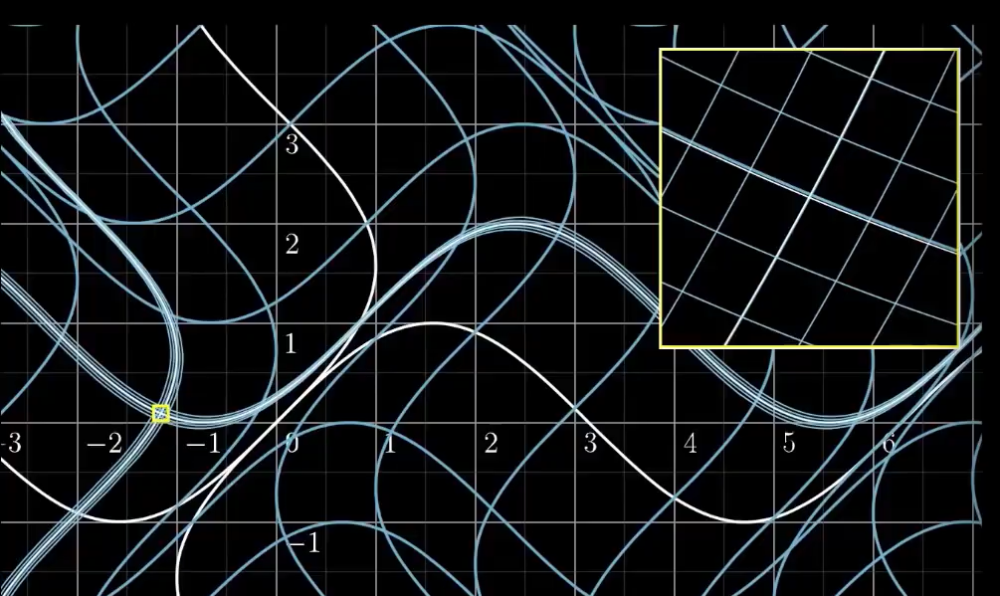
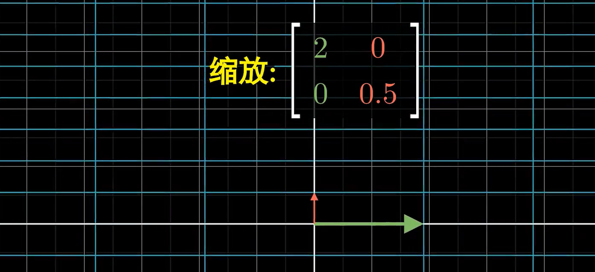
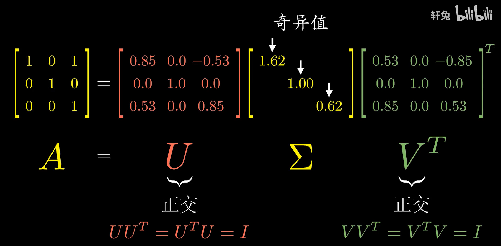
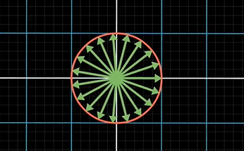
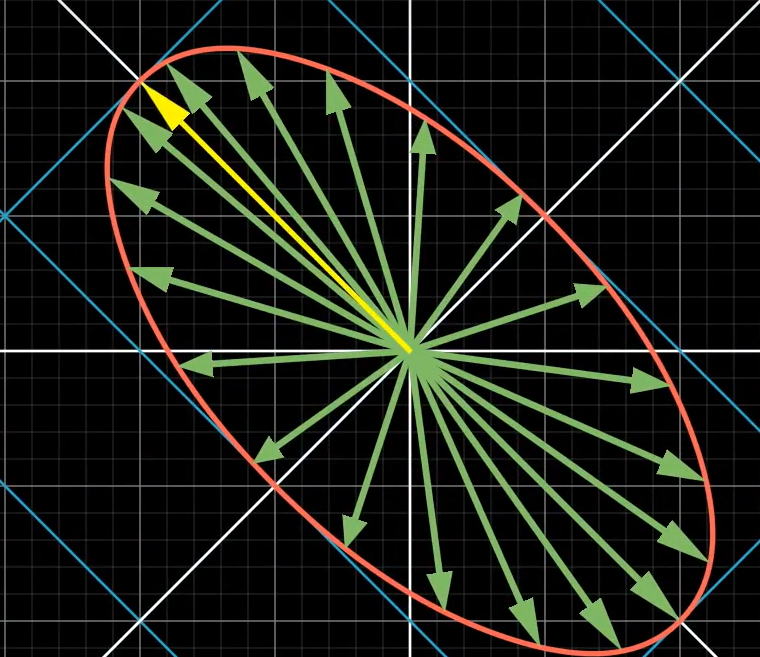

# 1. 矩阵计算问题

## 1.1 矩阵的导数

### 1.1.1 一阶偏导

$$
\begin{align*}
&定义f(X)是以矩阵X=[x_{ij}]为自变量的函数\\
&\frac{\partial f}{\partial X}=[\frac{\partial f}{\partial x_{ij}}]\\
&比如\\
&f(x_1,x_2)=[x_1,x_2]\cdot \begin{bmatrix}x_1\\x_2\end{bmatrix}=x_1^2+x_2^2\\
&\large \frac{\partial f}{\partial X}=\begin{bmatrix}\frac{\partial f}{\partial x_1}\\ \\  \frac{\partial f}{\partial x_2}\end{bmatrix}=\begin{bmatrix}2x_1\\2x_2\end{bmatrix}=2\begin{bmatrix}x_1\\x_2\end{bmatrix}\normalsize 竖着写叫分母布局\\
&f(x_1,...x_n)=X^TAX\to\frac{\partial f}{\partial X}=A^TX+AX\\
&如果A是对称矩阵，f为二次型\\
&\frac{\partial f}{\partial X}=2AX
\end{align*}
$$

还有一种在最优化中常见的写法为：$\nabla f(x)=[\frac{\partial f}{\partial x_i}]^T$

对于这样的函数，即可以看做是多元函数的补充形式，==输入一个向量，输出一直标量==

### 1.1.2 二阶偏导

二阶偏导即海瑟矩阵，
$$
\Large \nabla^2f(x)=\begin{bmatrix}
\frac{\partial^2 f(x)}{\partial x_1^2}&\frac{\partial^2 f(x)}{\partial x_1\partial x_2}&...&\frac{\partial^2 f(x)}{\partial x_1\partial x_n}\\
\frac{\partial^2 f(x)}{\partial x_2\partial x_1}&\frac{\partial^2 f(x)}{\partial x_2^2}&...&\frac{\partial^2 f(x)}{\partial x_2\partial x_n}\\
...&...&...&...\\
\frac{\partial^2 f(x)}{\partial x_n\partial x_1}&\frac{\partial^2 f(x)}{\partial x_n\partial x_2}&...&\frac{\partial^2 f(x)}{\partial x_n^2}\\

\end{bmatrix}
$$

### 1.1.3 雅可比矩阵

前面我们提到的函数和导数，本质上还是多元函数，而==向量值函数输入的依然是一个向量，但输出的是一个向量==

如果说前面的函数是多元函数的补充形式，那么向量值函数就是空间变换的补充形式，如：
$$
\Large f([x_1, x_2]^T)=\begin{bmatrix}
x_1+\sin(x_2)\\
x_2 +\sin(x_1)
\end{bmatrix}
$$
对于对于一个在$\R^n$上的向量$X=[x_i]$，向量值函数可以将空间$\R^n\to\R^m$
$$
\Large f(X)=\begin{bmatrix}y_1(X)\\y_2(X)\\...\\y_m(X)\end{bmatrix}
$$
雅可比矩阵的计算：
$$
\Large J(X)=\begin{bmatrix}
\nabla y_1(X)\\
\nabla y_2(X)\\
...\\
\nabla y_m(X)
\end{bmatrix}=\begin{bmatrix}
[\frac{\partial y_1}{\partial x_i}]\\
[\frac{\partial y_2}{\partial x_i}]\\
...\\
[\frac{\partial y_m}{\partial x_i}]
\end{bmatrix}_{m\times n}
$$
(注意：$X\in\R^n$)

这个向量值函数有m个公式组成，每个公式输入都是n个值，得到一个m x 1的向量作为结果

对于这个函数的导数就是雅可比矩阵，他描述的是，在变化过程中，各个分量的变化率的情况

我们可以引入类似一元函数的导数极限的概念，引入局部线性

我们可以看到在这个变换的局部放大来看他就近似于一个线性变化。假设变换都是n维到n维的，我们将原始空间设为$\R_1^n$，经过向量值函数变换后的空间是$\R_2^n$，经过雅可比矩阵变换后的空间为$\R_3^n$。

我们会发现在$X=[x_i]$上，$\R_2^n$和$\R_3^n$是局部相似的，更确切的说是$\R_3^n$的空间线是$\R_2^n$的空间线的切线。这些变换后的空间线，是沿雅可比矩阵的方向变换的。

## 1.2矩阵的迹 

当空间$\R^n$发生线性变化之后，如何判断几个发生线性变化的空间，原本是属于同一个空间的？

>  注意线性变化的概念和性质：首先线性变化在几何上要满足：1. 变化后原点不变，2.要保持原本平行于基的直线，依然保持平行且等距，要保持这一点，变化矩阵的秩就要保持不变

矩阵的迹是用来解答这样的问题的，定义为
$$
\Large \mathrm{tr}(A)=\sum \lambda_i
$$
其实我们不难发现，线性变化之后，两个矩阵是相似的，相似矩阵之间的共性就是，矩阵的特征值不变

性质：

1. $\mathrm{tr}(A)=\mathrm{tr}(A^T), \ \ \ \mathrm{tr}(A+B)=\mathrm{tr}(A)+\mathrm{tr}(B)$

2. $\mathrm{tr}(AB)=\mathrm{tr}(BA)=\sum_{i}^n\sum^m_ja_{ij}\cdot b_{ji}$

# 2. 范数

## 2.1 向量范数

称一个从向量空间$\R^n$到实数域$\R$的非负函数 $\| *\|$称为范数，==其旨在描述向量变换的长度==，不同的范数，即使用不同的方法计算得到的长度。对于向量v的$L_p$范数来说有：
$$
\Large \|v\|_p=\sqrt[p]{\sum|v_i|^p}
$$
即向量元素值的绝对值，p次方求和，求和结果开p次方根，易得
$$
\Large \lim_{p\to\infty}\|v\|_p= \lim_{p\to\infty}\sqrt[p]{\sum|v_i|^p}=\max_i |v_i|
$$

1. 正定性：每个向量元素都是0，即向量为零向量时，范数才能为零

   对于所有的$v\in\R^n$，有$\|v\|_p\ge0$，且$\|v\|=0$，当且仅当 *v* = 0；

2. 其次性：k倍向量的范数  =  k*向量的范数

   对于所有的$v\in\R^n$，有$k\in\R$，有$\|\alpha v\|=|\alpha| \cdot \|v\|$

3. 三角不等性：对于所有的$v, w\in\R^n$，有$\|v+w\|_p\le\|v\|+\|w\|$

## 2.2 矩阵范数

### 2.2.1 补充知识点：矩阵的奇异值分解

#### 几何意义

奇异值分解，即SVD分解。矩阵的本质是一次变化的过程，而奇异值分解旨在将矩阵的变化过程，分解为一个正交变化，一个伸缩变化，再一个正交变化

一个伸缩变换的矩阵结果就是一个对角阵：

奇异值分解可以写成这样的形式
$$
\Large A=U\Sigma V^T
$$
其中$U，V$都是正交变换，中间的$\Sigma$是一次伸缩变换，即他是一个对角阵，奇异值总是以大到小的排列，且都是非负的

**奇异值分解总是存在**，对于非方阵来说也是
$$
\begin{align*}
&\Large A_{n\times m}=U_{n\times n} \Sigma_{n\times m}V_{m\times m}\\
&\Large A = \begin{bmatrix}
1&0\\
1&1\\
0&1\\
\end{bmatrix}=
\begin{bmatrix}
0.41&0.71&0.58\\
-0.82&0.0&-0.58\\
-0.41&-0.71&0.58\\
\end{bmatrix}
\begin{bmatrix}
1.73&0\\
0&1\\
0&0\\
\end{bmatrix}
\begin{bmatrix}
-0.71&0.71\\
-0.71&-0.71\\
\end{bmatrix}^T
\end{align*}
$$
我们可以看见，一个非满秩矩阵，其变换过程必然导致维度的压缩，其分解的伸缩矩阵也得到了这一过程。$R(A)=R(\Sigma)$

#### 计算

$$
\begin{align*}
&\Large A=U\Sigma V^T, \ \ A^T=V\Sigma^T U^T\\
&\Large AA^T=U\Sigma U^T=U\Sigma U^{-1}\\
&\Large A^TA=V\Sigma V^T=V\Sigma V^{-1}\\
&\Large 
\end{align*}
$$

我们可以很容易看出，一些端倪：
$$
\begin{align*}
&\Large A=U\Sigma V^T, \ \ A^T=V\Sigma^T U^T\\
&\Large U^{-1}AA^T U=\Sigma\\
&\Large V^{-1}A^TAV=\Sigma \\
&\Large 
\end{align*}
$$

$$
\begin{align*}
&\Large U, V分别是AA^T, \ A^TA的正交对角化矩阵,u_i, \ v_i是对应特征向量\\
&\Large \Sigma=\mathrm{diag}{[\sigma_i]}是AA^T的特征值\\
\end{align*}
$$

### 2.2.2 诱导范数

和向量范数类似，矩阵范数是定义在矩阵空间上的非负函数，==旨在描述矩阵变化的长度==并且满足正定性、齐次性和三角不等式．

一总简单想到的方法是，对于所有的单位向量

用变换之后，最长的向量来描述

则表达式可以是：
$$
\Large \|A\|:=\max_{\|x\|=1}\|Ax\|=\max_{x\neq0}\frac{\|Ax\|}{\|x\|}
$$
其中x是一个向量，这个式子描述了单位向量经过A变化后，范数最大的向量，所以P范数的定义式为：
$$
\Large \|A\|_p=\max_{x\neq0}\frac{\|Ax\|_p}{\|x\|_p}
$$
对于1范数来说
$$
\Large \|A\|_1=\max_j\sum_i|a_{ij}|
$$
对于2范数来说
$$
\Large \|A\|_2=\sqrt{\lambda_{max}(A^TA)}
$$

### 2.2.3 Frobinus范数

$$
\Large \|A\|_F=\sqrt{\sum_{i,\ j}|a_{ij}|^2}=\sqrt{\mathrm{tr}(A^TA)}
$$

## 2.3 矩阵内积

而内积一般用来表征两个矩阵（或其张成的空间）之间的夹角，一般使用内积——Frobenius内积
$$
\Large <A, \ B>\ \ = \mathrm{tr}(AB^T)=\sum_{i=1}^n\sum_{j=1}^m a_{ij}b_{ij}
$$

