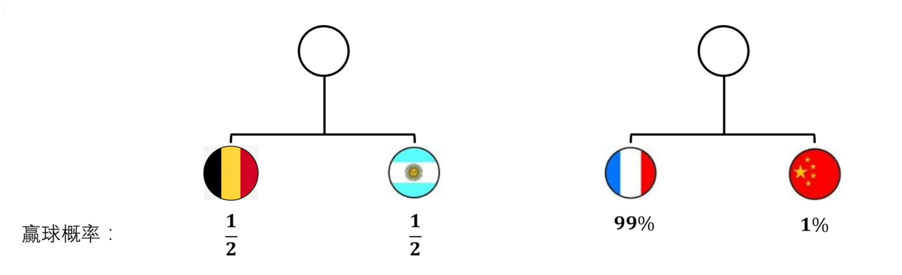

# 1. 矩阵计算问题

## 1.1 矩阵的导数

### 1.1.1 一阶偏导

$$
\begin{align*}
&定义f(X)是以矩阵X=[x_{ij}]为自变量的函数\\
&\frac{\partial f}{\partial X}=[\frac{\partial f}{\partial x_{ij}}]\\
&比如\\
&f(x_1,x_2)=[x_1,x_2]\cdot \begin{bmatrix}x_1\\x_2\end{bmatrix}=x_1^2+x_2^2\\
&\large \frac{\partial f}{\partial X}=\begin{bmatrix}\frac{\partial f}{\partial x_1}\\ \\  \frac{\partial f}{\partial x_2}\end{bmatrix}=\begin{bmatrix}2x_1\\2x_2\end{bmatrix}=2\begin{bmatrix}x_1\\x_2\end{bmatrix}\normalsize 竖着写叫分母布局\\
&f(x_1,...x_n)=X^TAX\to\frac{\partial f}{\partial X}=A^TX+AX\\
&如果A是对称矩阵，f为二次型\\
&\frac{\partial f}{\partial X}=2AX
\end{align*}
$$

还有一种在最优化中常见的写法为：$\nabla f(x)=[\frac{\partial f}{\partial x_i}]^T$

对于这样的函数，即可以看做是多元函数的补充形式，==输入一个向量，输出一直标量==

### 1.1.2 二阶偏导

二阶偏导即海瑟矩阵，
$$
\Large \nabla^2f(x)=\begin{bmatrix}
\frac{\partial^2 f(x)}{\partial x_1^2}&\frac{\partial^2 f(x)}{\partial x_1\partial x_2}&...&\frac{\partial^2 f(x)}{\partial x_1\partial x_n}\\
\frac{\partial^2 f(x)}{\partial x_2\partial x_1}&\frac{\partial^2 f(x)}{\partial x_2^2}&...&\frac{\partial^2 f(x)}{\partial x_2\partial x_n}\\
...&...&...&...\\
\frac{\partial^2 f(x)}{\partial x_n\partial x_1}&\frac{\partial^2 f(x)}{\partial x_n\partial x_2}&...&\frac{\partial^2 f(x)}{\partial x_n^2}\\

\end{bmatrix}
$$


### 1.1.3 雅可比矩阵

前面我们提到的函数和导数，本质上还是多元函数，而==向量值函数输入的依然是一个向量，但输出的是一个向量==

如果说前面的函数是多元函数的补充形式，那么向量值函数就是空间变换的补充形式，如：
$$
\Large f([x_1, x_2]^T)=\begin{bmatrix}
x_1+\sin(x_2)\\
x_2 +\sin(x_1)
\end{bmatrix}
$$
对于对于一个在$\R^n$上的向量$X=[x_i]$，向量值函数可以将空间$\R^n\to\R^m$
$$
\Large f(X)=\begin{bmatrix}y_1(X)\\y_2(X)\\...\\y_m(X)\end{bmatrix}
$$
雅可比矩阵的计算：
$$
\Large J(X)=\begin{bmatrix}
\nabla y_1(X)\\
\nabla y_2(X)\\
...\\
\nabla y_m(X)
\end{bmatrix}=\begin{bmatrix}
[\frac{\partial y_1}{\partial x_i}]\\
[\frac{\partial y_2}{\partial x_i}]\\
...\\
[\frac{\partial y_m}{\partial x_i}]
\end{bmatrix}_{m\times n}
$$
(注意：$X\in\R^n$)

这个向量值函数有m个公式组成，每个公式输入都是n个值，得到一个m x 1的向量作为结果

对于这个函数的导数就是雅可比矩阵，他描述的是，在变化过程中，各个分量的变化率的情况

我们可以引入类似一元函数的导数极限的概念，引入局部线性


我们可以看到在这个变换的局部放大来看他就近似于一个线性变化。假设变换都是n维到n维的，我们将原始空间设为$\R_1^n$，经过向量值函数变换后的空间是$\R_2^n$，经过雅可比矩阵变换后的空间为$\R_3^n$。

我们会发现在$X=[x_i]$上，$\R_2^n$和$\R_3^n$是局部相似的，更确切的说是$\R_3^n$的空间线是$\R_2^n$的空间线的切线。这些变换后的空间线，是沿雅可比矩阵的方向变换的。


## 1.2矩阵的迹 

当空间$\R^n$发生线性变化之后，如何判断几个发生线性变化的空间，原本是属于同一个空间的？

>  注意线性变化的概念和性质：首先线性变化在几何上要满足：1. 变化后原点不变，2.要保持原本平行于基的直线，依然保持平行且等距，要保持这一点，变化矩阵的秩就要保持不变

矩阵的迹是用来解答这样的问题的，定义为
$$
\Large \mathrm{tr}(A)=\sum \lambda_i
$$
其实我们不难发现，线性变化之后，两个矩阵是相似的，相似矩阵之间的共性就是，矩阵的特征值不变

性质：

1. $\mathrm{tr}(A)=\mathrm{tr}(A^T), \ \ \ \mathrm{tr}(A+B)=\mathrm{tr}(A)+\mathrm{tr}(B)$

2. $\mathrm{tr}(AB)=\mathrm{tr}(BA)=\sum_{i}^n\sum^m_ja_{ij}\cdot b_{ji}$

# 2. 范数

## 2.1 向量范数

称一个从向量空间$\R^n$到实数域$\R$的非负函数 $\| *\|$称为范数，==其旨在描述向量变换的长度==，不同的范数，即使用不同的方法计算得到的长度。对于向量v的$L_p$范数来说有：
$$
\Large \|v\|_p=\sqrt[p]{\sum|v_i|^p}
$$
即向量元素值的绝对值，p次方求和，求和结果开p次方根，易得
$$
\Large \lim_{p\to\infty}\|v\|_p= \lim_{p\to\infty}\sqrt[p]{\sum|v_i|^p}=\max_i |v_i|
$$

1. 正定性：每个向量元素都是0，即向量为零向量时，范数才能为零

   对于所有的$v\in\R^n$，有$\|v\|_p\ge0$，且$\|v\|=0$，当且仅当 *v* = 0；

2. 其次性：k倍向量的范数  =  k*向量的范数

   对于所有的$v\in\R^n$，有$k\in\R$，有$\|\alpha v\|=|\alpha| \cdot \|v\|$

3. 三角不等性：对于所有的$v, w\in\R^n$，有$\|v+w\|_p\le\|v\|+\|w\|$


## 2.2 矩阵范数

### 2.2.1 补充知识点：矩阵的奇异值分解

#### 几何意义

奇异值分解，即SVD分解。矩阵的本质是一次变化的过程，而奇异值分解旨在将矩阵的变化过程，分解为一个正交变化，一个伸缩变化，再一个正交变化

一个伸缩变换的矩阵结果就是一个对角阵：


奇异值分解可以写成这样的形式
$$
\Large A=U\Sigma V^T
$$
其中$U，V$都是正交变换，中间的$\Sigma$是一次伸缩变换，即他是一个对角阵，奇异值总是以大到小的排列，且都是非负的


**奇异值分解总是存在**，对于非方阵来说也是
$$
\begin{align*}
&\Large A_{n\times m}=U_{n\times n} \Sigma_{n\times m}V_{m\times m}\\
&\Large A = \begin{bmatrix}
1&0\\
1&1\\
0&1\\
\end{bmatrix}=
\begin{bmatrix}
0.41&0.71&0.58\\
-0.82&0.0&-0.58\\
-0.41&-0.71&0.58\\
\end{bmatrix}
\begin{bmatrix}
1.73&0\\
0&1\\
0&0\\
\end{bmatrix}
\begin{bmatrix}
-0.71&0.71\\
-0.71&-0.71\\
\end{bmatrix}^T
\end{align*}
$$
我们可以看见，一个非满秩矩阵，其变换过程必然导致维度的压缩，其分解的伸缩矩阵也得到了这一过程。$R(A)=R(\Sigma)$

#### 计算

$$
\begin{align*}
&\Large A=U\Sigma V^T, \ \ A^T=V\Sigma^T U^T\\
&\Large AA^T=U\Sigma U^T=U\Sigma U^{-1}\\
&\Large A^TA=V\Sigma V^T=V\Sigma V^{-1}\\
&\Large 
\end{align*}
$$

我们可以很容易看出，一些端倪：
$$
\begin{align*}
&\Large A=U\Sigma V^T, \ \ A^T=V\Sigma^T U^T\\
&\Large U^{-1}AA^T U=\Sigma\\
&\Large V^{-1}A^TAV=\Sigma \\
&\Large 
\end{align*}
$$

$$
\begin{align*}
&\Large U, V分别是AA^T, \ A^TA的正交对角化矩阵,u_i, \ v_i是对应特征向量\\
&\Large \Sigma=\mathrm{diag}{[\sigma_i]}是AA^T的特征值\\
\end{align*}
$$

### 2.2.2 诱导范数

和向量范数类似，矩阵范数是定义在矩阵空间上的非负函数，==旨在描述矩阵变化的长度==并且满足正定性、齐次性和三角不等式．

一总简单想到的方法是，对于所有的单位向量


用变换之后，最长的向量来描述


则表达式可以是：
$$
\Large \|A\|:=\max_{\|x\|=1}\|Ax\|=\max_{x\neq0}\frac{\|Ax\|}{\|x\|}
$$
其中x是一个向量，这个式子描述了单位向量经过A变化后，范数最大的向量，所以P范数的定义式为：
$$
\Large \|A\|_p=\max_{x\neq0}\frac{\|Ax\|_p}{\|x\|_p}
$$
对于1范数来说
$$
\Large \|A\|_1=\max_j\sum_i|a_{ij}|
$$
对于2范数来说
$$
\Large \|A\|_2=\sqrt{\lambda_{max}(A^TA)}
$$

### 2.2.3 Frobinus范数

$$
\Large \|A\|_F=\sqrt{\sum_{i,\ j}|a_{ij}|^2}=\sqrt{\mathrm{tr}(A^TA)}
$$


## 2.3 矩阵内积

而内积一般用来表征两个矩阵（或其张成的空间）之间的夹角，一般使用内积——Frobenius内积
$$
\Large <A, \ B>\ \ = \mathrm{tr}(AB^T)=\sum_{i=1}^n\sum_{j=1}^m a_{ij}b_{ij}
$$


# 3. 信息论

==根本目的是：为了实现对不同模型之间的比较和度量==，我们需要引入信息论中的许多概念。在信息论中许多概念是被定义出来的，是为了方便计算得出的，但只要其在整个体系中完成自洽即可，定义符号位：
$$
\Large :=
$$
如：牛顿三大定律之一的，是人为定义的，是牛顿的定义
$$
\Large F:=ma
$$
实际上是：
$$
\Large F\propto ma \ \ \ \ \ F\propto \frac{m_1 m_2}{r^2}
$$
牛顿选择了
$$
\Large F=ma
$$
为了体系自洽，得到：
$$
\Large F=G\frac{m_1 m_2}{r^2}(G是配平系数，使得体系自洽)
$$


## 3.1 信息量

信息量是指，信息的度量，如果用统计学的术语来描述，就是出现概率小的事件信息量多。信息量的表达式其实也是人为拼凑出来的，需求是：
$$
\begin{align*}
&\Large f(x):=信息量\\
&\Large f(桂工RM夺冠)=f(桂工进入决赛)+f(桂工赢得决赛)\\
&\Large 根据概率论：P(桂工RM夺冠)=P(桂工进入决赛)P(桂工赢得决赛)\\
&假设是独立事件
\end{align*}
$$
根据这样的需求，可以得到：
$$
\Large f(x_1\cdot x_2)=f(x_1)+f(x_2)
$$
并且，我们输入的x，得是概率，于是为了满足相乘=相加的原则我们可以拼凑出：
$$
\Large f(x):=?\log_?x
$$
由于log是增函数，但我们需要的是，概率越小信息量越大，是一个递减函数则：
$$
\Large f(x):=-\log_2 x
$$
取2为底的好处是和抛硬币取类比，如$f(\frac{1}{2})=-\log_2\frac{1}{2}=1$则信息量为抛一个硬币正面朝上（下）的信息量，取单位为bit。这样便于在信息传输时，对bit流的信息量进行评估


## 3.2 信息熵

熵在热力学中指代的是用来度量一个系统的稳定性。信息熵是指，人们对多个事件的未来预期的稳定性，或者说可预测性。==可预测性高，稳定性强，则信息熵低==，反之信息熵则高。比如，多个事件都很有可能发生，那么预期是不稳定的，信息熵就大。当多个事件中，只有一个和个别几个事件发生概率很大，其他事件发生概率很小，则信息熵就小。



对于德国和阿根廷，赢球概率各是50%；法国和中国，则分别是99%和1%；对于这样的事件组来说，德国和阿根廷的不稳定性就更高，因为都有可能赢，就更难预测，则信息熵就高，而法国和中国，法国赢概率大得多，更容易预测，则可预测性就高，信息熵就低。

德阿球赛：

| 球队   | 德国队          | 阿根廷队       |
| ------ | --------------- | -------------- |
| 胜概率 | $\frac{1}{2}$   | $\frac{1}{2}$  |
| 信息量 | $-\log_2 0.5=1$ | $-\log_20.5=1$ |

中法球赛

| 球队   | 法国队                | 中国队               |
| ------ | --------------------- | -------------------- |
| 胜概率 | 99%                   | 1%                   |
| 信息量 | $-\log_2 0.99=0.0145$ | $-\log_2 0.1=6.6439$ |

那么我们可以使用对信息量的加权来描述，不同事件在整个系统中的贡献，以此作为熵：

<style type="text/css">
.tg  {border-collapse:collapse;border-spacing:0;}
.tg td{border-color:black;border-style:solid;border-width:1px;font-family:Arial, sans-serif;font-size:14px;
  overflow:hidden;padding:10px 5px;word-break:normal;}
.tg th{border-color:black;border-style:solid;border-width:1px;font-family:Arial, sans-serif;font-size:14px;
  font-weight:normal;overflow:hidden;padding:10px 5px;word-break:normal;}
.tg .tg-c3ow{border-color:inherit;text-align:center;vertical-align:top}
</style>
<table class="tg">
<thead>
  <tr>
    <th class="tg-c3ow">球队</th>
    <th class="tg-c3ow">法国队</th>
    <th class="tg-c3ow">中国队</th>
    <th class="tg-c3ow">德国队</th>
    <th class="tg-c3ow">阿根廷</th>
  </tr>
</thead>
<tbody>
  <tr>
    <td class="tg-c3ow">胜率</td>
    <td class="tg-c3ow">0.99</td>
    <td class="tg-c3ow">0.01</td>
    <td class="tg-c3ow">0.5</td>
    <td class="tg-c3ow">0.5</td>
  </tr>
  <tr>
    <td class="tg-c3ow">信息量</td>
    <td class="tg-c3ow">0.0145</td>
    <td class="tg-c3ow">6.6439</td>
    <td class="tg-c3ow">1</td>
    <td class="tg-c3ow">1</td>
  </tr>
  <tr>
    <td class="tg-c3ow">贡献度</td>
    <td class="tg-c3ow">0.0145*0.99=0.01435</td>
    <td class="tg-c3ow">0.01*6.6439=0.066439</td>
    <td class="tg-c3ow">0.5</td>
    <td class="tg-c3ow">0.5</td>
  </tr>
  <tr>
    <td class="tg-c3ow">信息熵</td>
    <td class="tg-c3ow" colspan="2">0.01435+0.066439≈0.081</td>
    <td class="tg-c3ow" colspan="2">0.5+0.5=1</td>
  </tr>
</tbody>
</table>

我们可以发现，这样计算之后，中法球赛和信息熵确实要比德阿球赛的信息熵要低，即可以定义：
$$
\Large H(p):=\sum_{i=1}^n p_i\cdot f(p_i)
$$
这种对信息量的加权平均，即信息量的期望：
$$
\Large H(p):=E(p_f)=\sum_{i=1}^n p_i\cdot f(p_i)=-\sum_{i=1}^n p_i\cdot \log_2p_i
$$


## 3.2 相对熵（KL散度）与交叉熵

### KL散度

为了实现对两个概率系统的比较，我们引入了==KL散度==


对于这样两个概率系统，其信息量分别为：
$$
\Large f_Q(x)、f_P(x)
$$
我们定义：
$$
\begin{align*}
&\Large D_{KL}(P||Q)
\end{align*}
$$
这个D是divergence，指的是差异。这个符号指的是表示在基准为 *Q* 的情况下，使用概率分布 *P* 来表示的信息损失。
$$
\begin{align*}
&\Large D_{KL}(P||Q):=\sum_{i=1}^n p_i [f_Q(q_i)-f_p(p_i)] \{信息量差\}\\
&\Large \ \ \ \ \ \ \ \ \ \ \ \ \ \ \ \ \ \ \ \ \ = \sum_{i=1}^np_i\cdot(-\log_2 q_i)\{下一节的交叉熵\}-\sum_{i=1}^n p_i\cdot(-\log_2 p_i)\{P模型的熵\}\\

\end{align*}
$$


### 吉布斯不等式的证明

吉布斯不等式：

当满足时：
$$
\Large \sum p_i=1=\sum q_i
$$
可以证明有：
$$
\Large \sum_{i=1}^np_i\cdot(-\log_2 q_i)\ge\sum_{i=1}^n p_i\cdot(-\log_2 p_i)
$$
等价于证明：
$$
\begin{align*}
&\Large D_{KL}(P||Q):=\sum_{i=1}^n p_i [f_Q(q_i)-f_p(p_i)] \ge 0\\
&\Large \to  \ \ \ \ \ \ \ \ \ \ \ \ \ \ \ \ = \sum_{i=1}^n p_i\log_2 \frac{p_i}{q_i}\\
&\Large \ \ \ \ \ \ \ \ \ \ \ \ \ \ \ \ \ \ \ \ \ =-\sum p_i\log_2\frac{q_i}{p_i}\ge-\sum p_i(1-\frac{q_i}{p_i})=-\sum p_i-q_i=0
\end{align*}
$$
所以
$$
\Large D_{KL}(P||Q):=\sum_{i=1}^n p_i [f_Q(q_i)-f_p(p_i)] \ge 0
$$


### 交叉熵

前面我们可以推导得到：
$$
\begin{align*}
&\Large D_{KL}(P||Q)= \sum_{i=1}^np_i\cdot(-\log_2 q_i)\{交叉熵\}-\sum_{i=1}^n p_i\cdot(-\log_2 p_i)\{P模型的熵\}\ge 0\\

\end{align*}
$$
==P模型的信息熵即P模型信息量的期望，这是一个固定值==，且交叉熵和信息熵均大于0

的那么根据上面的不等式我们可以得出这样的结论：

<center style="color:red;">交叉熵越大，LK散度越大</center>

<center style="color:red;">交叉熵越小，LK散度越小</center>

我们记交叉熵为：
$$
\Large H(P, Q)=\sum_{i=1}^np_i(-\log_2q_i)
$$
当我们期待两个模型接近的时候，只需要最小化交叉熵即可


## 3.3 最大熵原理

==尽力了，只能感性些许理解，但在数学上和其他东西穿不起来，真的理解不了，不知道为什么熵越大模型越好==

最大熵原理是概率模型学习的一个准则．最大熵原理认为，学习概率模型时，在所有可能的概率模型（分布）中，熵最大的模型是最好的模型．通常用约束条件来确定概率模型的集合，所以，最大熵原理也可以表述为在满足约束条件的模型集合中选取熵最大的模型．

直观地，最大熵原理认为要选择的概率模型首先必须满足已有的事实，即约束条件．==在没有更多信息的情况下，那些不确定的部分都是“等可能的”==．最大熵原理通过熵的最大化来表示等可能性．“等可能”不容易操作，而熵则是一个可优化的数值指标．

在毫无先验（经验）概率的情况下，ABCD的概率为：$P(A)=P(B)=P(C)=P(D)=\frac{1}{4}$是熵达到最大

当有先验的时候，除了先验以外的，概率相等，熵达到最大，如先验得到：$P(A)=0.5，P(B)=0.25$，那么，剩下未知的则$P(C)=P(D)=0.125$

 对于分类问题来说，我们期待得到的是条件概率，即输入为X，各个输出Y_i的概率是多少，即：$P(Y|X),y_i\in Y$，所以我们在分类问题中，期待的最大熵，是条件熵
$$
\Large -\sum_{i=1}^nP(Y|X)\log P(Y|X)
$$
假设分类模型是一个条件概率分布$P(Y|X)$，$X\in\chi\subseteq R^n$为输入，Y为输出。给定一个训练数据集：
$$
\Large T=\{(x_1,y_1),..,(x_n,y_n)\}
$$
学习的目标是用最大熵原理选择最好的分类模型

我们可以确定联合分布的经验分布和边缘分布的经验分布，分别以：$\widetilde{P}(X,Y), \ \widetilde{P}(X)$,在这里为：
$$
\begin{align*}
&\Large \widetilde{P}(X=x, Y=y)=\frac{V(X=x,Y=y)}{N}\\
&\Large \widetilde{P}(X=x)=\frac{V(X=x)}{N}\\
\end{align*}
$$
其中$V()$代表的是出现的频出，在这里的经验即频率，即(x,y)同时出现的频率和x出现的频率，N为总量

根据贝叶斯公式我们可以得到：
$$
\Large \widetilde{P}(X,Y)≈ \widetilde{P}(X)\cdot P(Y|X)
$$
用指示函数（indicator function）$f(x,y)$描述输入 *x* 和输出 *y* 之间的某一个事实．其定义是：
$$
\Large f(x,y)=\begin{cases}
1&,x与y满足某一事实\\
0&,否则
\end{cases}
$$
这是一个二值函数，当 *x* 和 *y* 满足这个事实时取值为 1，否则取值为 0．比如对于事件A来说，要满足：{X：有爪子，长胡子，有绒毛，喵喵叫；Y：是猫，不是狗，不是鸭}，那么则会得到事件A的伯努利分布

| 满足A                                 | 不满足A              |
| ------------------------------------- | -------------------- |
| $\widetilde{P}(A)=\widetilde{P}(x,y)$ | $1-\widetilde{P}(A)$ |

$$
\Large E(f)=1\cdot \widetilde{P}(A)+0\cdot (1-\widetilde{P}(A))=\widetilde{P}(A)
$$


指示函数$f(x,y)$关于经验分布$\widetilde{P}(X,Y)$的期望值，用$E_{\widetilde{P}}(f)$表示
$$
\Large E_{\widetilde{P}}(f)=\sum_{x,y}\widetilde{P}(x,y)f(x,y)=\widetilde{P}(x,y)
$$
指示函数$f(x,y)$关于模型$P(Y|X)$与经验分布$\widetilde{P}(X)$的期待值，用$E_p(f)$表示。
$$
\Large E_p(f)=\sum_{x,y}P(y,x)f(x,y)=\sum_{x,y}\widetilde{P}(x)P(y|x)f(x,y)=\widetilde{P}(x)P(y|x)
$$
如果模型能够获取训练数据中的信息，那么需要让两个期望值相等，即
$$
\Large E_p(f)=E_{\widetilde{p}}(f)
$$

对于事件A=$(x_1^{(A)}...,x_n^{(A)}, y^{(A)}_1,...,y^{(A)}_m)$来说我们有条件熵：
$$
\Large H(Y|X=x^{(A)})=-\sum_{i=1}^n P(y^{(A)}_i|X^{(A)})\log P(y^{(A)}_i|X^{(A)})
$$
对于所有的事件的条件熵为：
$$
\begin{align*}
&\Large H(Y|X):=E(H(Y|X=x^{(k)}))\\
&\Large \ \ \ \ \ \ \ \ \ \ \ \ \ \ \ =-\sum_{k=A}^{所有事件}p(x^{(k)})H(Y|X=x^{(k)})\\
&\Large \ \ \ \ \ \ \ \ \ \ \ \ \ \ \ =-\sum_{k=A}^{所有事件}p(x^{(k)})\cdot [-\sum^{n}_{i=1}P(y_i^{(k)}|x^{(k)})\log P(y^{(k)}_i|x^{(k)})]\\
\end{align*}
$$

$$
& \Large -\sum_{k=A}^nP(x^{(k)})H^{(k)} \begin{cases}
H^{(A)}=-\sum_{i=1}^n P(y^{(A)}_i|x^{(A)})\log P(y^{(A)}_i|x^{(A)})\\
H^{(B)}=-\sum_{i=1}^n P(y^{(B)}_i|x^{(B)})\log P(y^{(B)}_i|x^{(B)})\\
...\\
H^{(..)}=-\sum_{i=1}^n P(y^{(..)}_i|x^{(..)})\log P(y^{(..)}_i|x^{(..)})\\
\end{cases}\\
$$

因为我们并不知道$P(x^{(k)})$的值，但我们可以获得先验$\widetilde{P}(x)$，用这个来近似替代得到：
$$
\Large H(Y|X)=\widetilde{P}(X)P(Y|X)\log P(Y|X)
$$
==总结：我们要让先验的，已知的部分相等，要让未知的部分熵最大==

求极大值：
$$
\begin{align*}
&\Large \max H(Y|X)=\max -\sum..=\min\sum\widetilde{P}(X)P(Y|X)\log[P(Y|X)]\\
&\Large 约束 ：\\
&1.\Large E_{\widetilde{p}}(f(x,y))-E_p(f(x,y))=0\\
&\ \ \ \Large \Delta_k -E_p(f_k(x,y))=0，因为E_{\widetilde{p}}(f(x,y))是常数，写成\Delta就好了\\
&2.\Large 1-\sum_y P(y|x)=0\\
\end{align*}
$$
约束2 是指，在固定输入X的情况下，所有y的概率总和是1，这是一个多元函数求极值问题，用拉格朗日乘数法：
$$
\begin{align*}
&\Large L(P, \lambda)=\sum_{x,y}\widetilde{P}(X)P(Y|X)\log P(Y|X)+\lambda_0(1-\sum_yP(y|x))+\sum_{k=A}^{所有事件}\lambda_k (\Delta_k-E_p(f_k(x,y)))\\
&\Large  \ \ \ \ \ \ \ \ \ \  \ \ \ = .....+\sum_{k=A}^{所有事件}\lambda_k[\Delta_k-\sum_{x,y}\widetilde{P}(x)P(y|x)f_k(x,y)]
\end{align*}
$$
根据==拉格朗日对偶性==可得：
$$
\Large \min_P \max_{\lambda} L(P,\lambda) \Leftrightarrow对偶问题 \max_{\lambda}\min_P L(P,\lambda)
$$
即，把P（或$\lambda$）当做常数，探求当$\lambda$（或P）取什么值时，L最小

于是求偏导
$$
\Large \frac{\partial L(P,\lambda)}{\partial P(y|x)}=
$$


# 4. 复变函傅里叶变换

傅里叶变换是将函数（曲线）分解为若干个三角函数的线性组合，那么他是如何完成这一步的呢？

对于一个函数的，例如$f(x)=\sin x$，如果我们用不同频率的$\sin$函数和他相乘将得到有意思的结果：（例如$\sin 2x$


当我们对相乘的结果在一个周期上求积分之后，我们可以发现$\sin x \cdot \sin 2x$的结果是0，我们可以认为，他们之间是正交的；即$\sin 2x$不在$\sin x$的曲线内。如果一个函数在$f(x)$中有贡献，求出来的应该是较高的

那么对于一个有随机噪声的曲线呢？


$$
\Large f(x)=\sin(x+3)+噪声
$$
对于有噪声的函数也可以很好的得到其周期

```python
def FourierTransform(omega, X, Func):
    newY = np.sin(omega * X) * Func(X)
    deltaX = X[1] - X[0]
    area = np.fabs(deltaX * np.sum(newY))
    return area
```

面积计算是用逼近的方式：
$$
\Large S = |\sum\Delta x \cdot y_i|=|\Delta x\sum y_i|
$$
但是这个方法仍然存在一个问题，无法有效的处理相变的问题，如对于函数
$$
\Large f(x)=\sin(x+\frac{\pi}{2})
$$


在omega=1时，面积取得0，使得我们无法正常得到正确的OMEGA

故而需要进行加入相位的计算，寻找合适的。所谓的相位，我们可以简化的认为，所有的相位本质上都是$\cos x $和$\sin x$的线性组合（也可能是这个线性组合的相反数）：
$$
\Large f(x)=\sin (\omega x +b)=\pm(p\sin x+q\cos x)(p +q=1)
$$
而p和q就是面积比。我们分别用$\sin x$和$\cos x $与$f(x)$相乘，求他们的面积，然后按照面积的比值来确定p和q

对于函数
$$
\Large f(x)=\sin(x+\frac{\pi}{2})
$$
我们计算得到：


omega=1的位置，得到最大的area。

由傅里叶变化的定义可以得到：
$$
\Large sigma \times \cos(2\pi f t)+ i \ sigma\times \sin(2\pi ft)
$$
我们可以写成欧拉公式的样子：
$$
\Large F(\omega)=\int sigma\times e^{i\omega t}\mathrm{d}t=\int sigma \times \cos(\omega t)+ i \ sigma\times \sin(\omega t)\mathrm{d}t
$$


# 5.  概率分布的特征函数

特征函数的意义在于，==通过它可以唯一地确定一组概率分布==。具体来说,如果两个随机变量的特征函数完全相同,那么这两个随机变量满足相同的分布。对于连续型分布随机变量来说有：
$$
\Large \phi(t)=\int^\infty_{-\infty} e^{jtx}f(x)\mathrm{d}x
$$
其概率密度函数为$f(x)$，我们可以发现他可以写成：
$$
\Large \phi(t)=\int^\infty_{-\infty}e^{itx}f(x)\mathrm{d}x=E_X(e^{itx})
$$


随机变量为离散型随机变量，且其分布列为$p(x)$，则特征函数可表示为：
$$
\Large \sum_{i=1}^\infty e^{jtx}p(x_i)
$$
同样：
$$
\Large \phi(t)=E_X(e^{itx})
$$

我们还可以发现
$$
\Large \phi(t)=\int^\infty_{-\infty}e^{itx}f(x)\mathrm{d}x
$$

这和傅里叶变换极其相似，但傅里叶变化是：
$$
\Large F(t)=\int^\infty_{-\infty}e^{\color{red}-\\itx}f(x)\mathrm{d}x
$$
特征函数是傅里叶变换的共轭关系，但变换结果是相似的，特征函数把分布函数换到另外一个坐标系，==傅里叶变换和原函数是一一对应的，则特征函数和概率分布也是一一对应的==因此可以获得一些计算的好处：

1. 假如我们不知道分布函数，但是通过实验算出了期望、方差、偏度、峰度等，那么可以用特征函数去代替分布函数

2. 两个分布函数的卷积通过特征函数更换坐标系后，可以变为更容易计算的乘法

   .....


