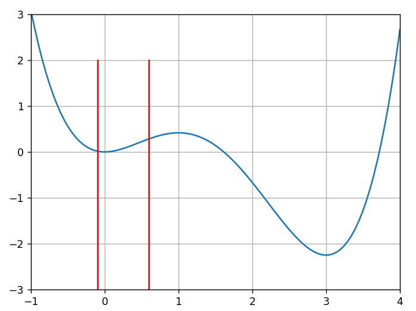
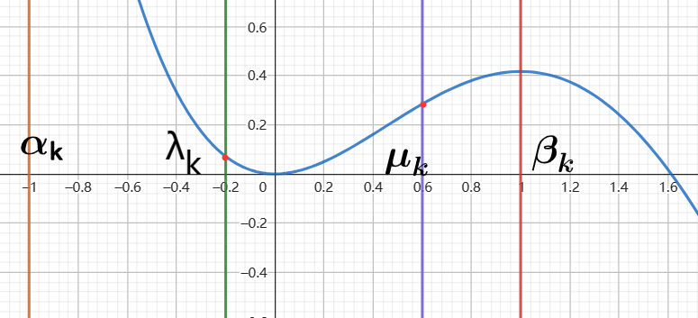
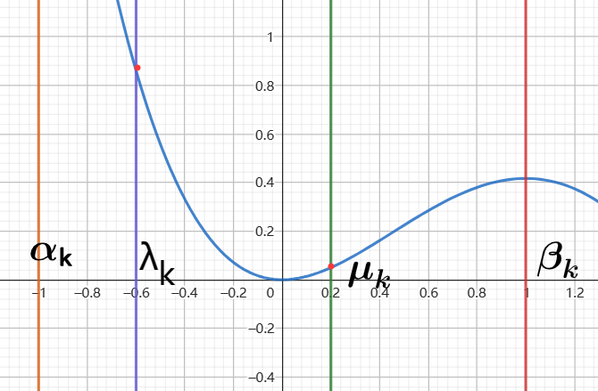

# 1. 概念

一维搜索是在一个给定的函数f(x)中，寻找极值或者最值的过程

# 2. 试探法

此方法是用在单峰函数上进行的，

## 2.1. 进退法

在一个多峰函数中，通过进退法确定波谷区间，在波谷区间里面搜索极小值点（最小值点）

**进退发**用来寻找波谷区间（注意这是一个函数的波谷，离散数据不能用这个方法）


算法的思路


```python
#  确定单峰区间
def successFailMethod(x1, h, func):  # x1为初始位置，h为步进长度
    f1 = func(x1)
    x2 = x1 + h
    f2 = func(x2)
    if f2 < f1:
        while True:
            x3 = x2 + h
            f3 = func(x3)
            if f3 < f2:
                x2 = x3
                f2 = f3
            else:
                break
        return [x1, x3]
    else:
        while True:
            x3 = x1 - h
            f3 = func(x3)
            if f3 < f1:
                x1 = x3
                f1 = f3
            else:
                break
        return [x3, x2]
```




## 2.2. 确定极小值点

已知多峰函数的单峰区间，或者单峰函数即可用**试探法**确定极小值点（最小值点）

### 2.2.1. 黄金分割法

#### 2.2.1.1基本思路

在区间$[a_k, b_k]$， 尝试点为$\lambda_k=\alpha_k+(1-\tau)(b_k - a_k)$，$u_k=\alpha_k+\tau(b_k-\alpha_k)$，



如果$f(\lambda_k)<f(\mu_k)$则极小值（最小值）可能在$[\alpha_k, \ \mu_k]$上，不可能在$[\mu_k, \ \beta_k]$上，则

我们更新边界：$f(\lambda_k)<f(\mu_k), \ \to \alpha_{k+1}=\alpha_k, \ \beta_{k+1}= \mu_k$



如果$f(\lambda_k)>f(\mu_k)$则极小值（最小值）可能在$[\lambda_k, \ \beta_k]$上，不可能在$[\alpha_k, \ \mu_k]$上，则

我们更新边界：$f(\lambda_k)>f(\mu_k), \ \to \alpha_{k+1}=\lambda_k, \ \beta_{k+1}= \beta_k$


#### 2.2.2.2 $\tau$的取值


