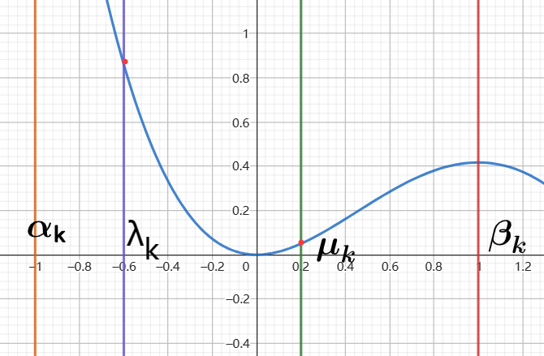

# 1. 概念

我们将求解$f(x)$的最小值点的过程比喻成下山的过程．假设一个人处于某点x处，$f(x)$表示此地的高度，为了寻找最低点，在点 *x* 处需要确定如下两件事情：

> 1. 下一步该向哪一方向行走
> 2. 沿着该方向行走多远后停下以便选取下一个下山方向

确定后，便可以一直重复，直至到达 *f*(*x*) 的最小值点．

线搜索类算法的数学表述为：给定当前迭代点$x_k$，首先通过某种算法选取向量$d_k$，之后确定正数$\alpha_k$，则下一步的迭代点可写作：
$$
\Large x_{k+1}=x_k+\alpha_kd_k
$$
其中，$d_k$为迭代点$x_k$的搜索方向，$\alpha_k$为步长，这里要求$d_k$是一个下降的方向。

优化方向一般是**负梯度方向或者设计二阶偏导数**，但是某些情况下导数很难计算。这时需要自己设计一个优化方向，或者不需要知道优化方向，采用猜测的方法，当结果为函数减小的方向时，继续在此方向搜索；结果为函数增大的方向，沿着反方向搜索。这种方法称为搜索法。


# 2. 试探法（线搜索）

此方法是用在单峰函数上进行的，

## 2.1. 进退法

在一个多峰函数中，通过进退法确定波谷区间，在波谷区间里面搜索极小值点（最小值点）

**进退法**用来寻找波谷区间（注意这是一个函数的波谷，离散数据不能用这个方法）


算法的思路


```python
#  确定单峰区间
def successFailMethod(x1, h, func):  # x1为初始位置，h为步进长度
    f1 = func(x1)
    x2 = x1 + h
    f2 = func(x2)
    if f2 < f1:
        while True:
            x3 = x2 + h
            f3 = func(x3)
            if f3 < f2:
                x2 = x3
                f2 = f3
            else:
                break
        return [x1, x3]
    else:
        while True:
            x3 = x1 - h
            f3 = func(x3)
            if f3 < f1:
                x1 = x3
                f1 = f3
            else:
                break
        return [x3, x2]
```


## 2.2. 精确线搜索

已知多峰函数的单峰区间，或者单峰函数即可用**试探法**确定极小值点（最小值点）

基本思路是 ↓

在区间$[a_k, b_k]$， 尝试点为$\lambda_k$和$\mu_k$


如果$f(\lambda_k)<f(\mu_k)$则极小值（最小值）一定在$[\alpha_k, \ \mu_k]$上，不可能在$[\mu_k, \ \beta_k]$上，则

我们更新边界：$f(\lambda_k)<f(\mu_k), \ \to \alpha_{k+1}=\alpha_k, \ \beta_{k+1}= \mu_k$



如果$f(\lambda_k)>f(\mu_k)$则极小值（最小值）一定在$[\lambda_k, \ \beta_k]$上，不可能在$[\alpha_k, \ \mu_k]$上，则

我们更新边界：$f(\lambda_k)>f(\mu_k), \ \to \alpha_{k+1}=\lambda_k, \ \beta_{k+1}= \beta_k$

下面两个方法的共同目标是减少计算的次数，为了减少计算过程更新的，算法会利用上次计算的结果。


在这个例子中，$\beta_{k+1} =\mu_k$, $\alpha_{k+1}=\alpha_k$,为了减少计算此时，可以让新的$\mu_{k+1}=\lambda_k$，$f(\mu_{k+1})=f(\lambda_k)$，如下图。

这样便可以减少一次计算，变成探索极值点是否在上图的$[\alpha_{k}, \ \lambda_k]$上


两个算法的不同的点在于$\lambda_k、\beta_k$的计算方法，以及$\tau_k$的取值

判断是否收敛的依据是：当$|\mu_k-\lambda_k|<\epsilon$时，就认为已经收敛，取值为$[\lambda,k-\mu_k]$区间上的点


### 2.2.1. 黄金分割法

#### 2.2.1.1 基本方法

黄金分割法，试探点的计算方法为：$\lambda_k=\alpha_k+(1-\tau)(b_k - a_k)$，$u_k=\alpha_k+\tau(b_k-\alpha_k)$

为了实现这一点$\mu_{k+1}=\lambda_k$：
$$
\begin{align*}
&\Large \mu_{k+1}=\alpha_{k+1}+\tau(b_{k+1}-\alpha_{k+1})\\
&\Large 因为\alpha_{k+1}=\alpha_k,\beta_{k+1}=\mu_k\\
&\Large  \mu_{k+1}=\alpha_{k+1}+\tau(b_{k+1}-\alpha_{k+1})\\
&\Large \ \ \ \ \ \ \ \  =\alpha_k+\tau(\mu_k-\alpha_k)\\
&\Large \ \ \ \ \ \ \ \  = \alpha_k+\tau[a_k+\tau(\beta_k-\alpha_k)-\alpha_k]\\
&\Large \ \ \ \ \ \ \ \  =\alpha_k+\tau^2(\beta_k-\alpha_k)\\
&\Large \mu_{k+1}=\alpha_k+\tau^2(\beta_k-\alpha_k)=\lambda_k=\lambda_k+(1-\tau)(\beta_k-\alpha_k) \\
&\Large \tau^2=1-\tau\to\tau=\frac{\sqrt{5}-1}{2}=0.618
\end{align*}
$$

另一种情况，计算结果是一样的，都是$\tau=\frac{\sqrt{5}-1}{2}$

#### 2.2.1.收敛率

拿$f(\lambda_k)>f(\mu_k), \ \to \alpha_{k+1}=\lambda_k, \ \beta_{k+1}= \beta_k$这种情况为例
$$
\begin{align*}
&\Large \beta_{k+1}-\alpha_{k+1}=\beta_k-[\alpha_k+(1-\tau)(\beta_k-\alpha_k)]=\tau(\beta_k-\alpha_k)\\
&\Large \frac{\beta_{k+1}-\alpha_{k+1}}{\beta_k-\alpha_k}=\tau\\
&\Large \beta_k-\alpha_k=\tau(\beta_{k-1}-\alpha_{k-1})=...=\tau^k(\beta_0-\alpha_0)<\epsilon\\
&\Large k\ge\ln_\tau\frac{\epsilon}{(\beta_0-\alpha_0)}\to k=\lceil \ln_\tau\frac{\epsilon}{(\beta_0-\alpha_0)}\rceil
\end{align*}
$$


即，我们至少要进行k次才能收敛

```python
#  黄金分割法确定单峰区间内的极值点
def goldenSectionMethod(l, r, epsilon, func):
    """
    :param l: 区间左
    :param r: 区间右
    :param epsilon: 精度，r - l < epsilon时退出
    :param func: 函数
    :return: 返回极小值的x
    """
    num = 0
    tau = (np.sqrt(5) - 1) / 2
    original_R, original_L = r, l
    while r - l > epsilon:
        Lambda = l + (1 - tau) * (r - l)
        Mu = l + tau * (r - l)
        yLambda = func(Lambda)
        yMu = func(Mu)
        if yLambda < yMu:
            l = l
            r = Mu
        else:
            l = Lambda
            r = r
        num += 1
    return (r + l) / 2, np.ceil(np.log(epsilon / (original_R - original_L)) / np.log(tau)), num
```


### 2.2.2斐波那契数列法

#### 2.2.2.1 方法

​	此方法的探测点计算为：

**下面这个n是预设的，在求收敛率的时候会求n**

$\Large \lambda_k=\alpha_k+ \frac{F_{n-k-1}}{F_{n-k+1}}(\beta_k-\alpha_k), \ \mu_k=\alpha_k +\frac{F_{n-k}}{F_{n-k+1}}(\beta_k-\alpha_k)$

可以证明$\mu_{k+1}=\lambda_k$
$$
\begin{align*}
&\Large \mu_{k+1} =\alpha_{k+1} +\frac{F_{n-(k+1)}}{F_{n-(k+1) + 1}}(\beta_{k+1}-\alpha_{k+1}) \\
&\Large \ \ \ \ \ \ \ \  = \alpha_k+\frac{F_{n-k-1}}{F_{n-k}}(\mu_k-\alpha_k)\\
&\Large \ \ \ \ \ \ \ \  =  \alpha_k+\frac{F_{n-k-1}}{F_{n-k}}(\alpha_k +\frac{F_{n-k}}{F_{n-k+1}}(\beta_k-\alpha_k)-\alpha_k)\\
&\Large \ \ \ \ \ \ \ \  =  \alpha_k+\frac{F_{n-k-1}}{F_{F-k+1}}(\beta_k-\alpha_k)\\
&\Large \ \ \ \ \ \ \ \  =  \lambda_k
\end{align*}
$$

#### 2.2.2.2  收敛率

以$\alpha_{k+1} = \alpha_k$，$\beta_{k+1} = \mu_k$为例子
$$
\begin{align*}
&\Large \beta_{k+1}-\alpha_{k+1}= \mu_k - \alpha_k =[\alpha_k +\frac{F_{n-k}}{F_{n-k+1}}(\beta_k-\alpha_k)]-\alpha_k=\frac{F_{n-k}}{F_{n-k+1}}(\beta_k-\alpha_k)\\
&\Large \frac{\beta_{k+1}-\alpha_{k+1}}{\beta_k-\alpha_k}=\frac{F_{n-k}}{F_{n-k+1}}\\
&\Large k=1\to \beta_2-\alpha_2=\frac{F_{n-1}}{F_n}(\beta_1-\alpha_1)\\
&...\\
&\Large k=n-1\to \beta_n-\alpha_n=\frac{F_1}{F_2}(\beta_{n-1}-\alpha_{n-1})\\
&\Large \beta_n-\alpha_n=\frac{1}{F_n}(\beta_1-\alpha_1)<\epsilon\\
&\Large F_n> \frac{\beta_1-\alpha_1}{\epsilon}\to n
\end{align*}
$$

### 2.3 非精准先搜索

以往我们都会尽可能的得到一个精确下降值，为了得到一个最满意的下降值，下降值本身也需要进行迭代，但事实上不需要完全精确的下降值

#### 2.3.1  **Goldstein**准则

在每一轮迭代过程中，对于下降值的迭代为$\phi(\alpha)=f(x_k+\alpha\mathrm{d}_k)$，虽然不需要得到精确的下降结果，但为了使得其充分下降，可以收敛，我们其设定了一些准则

$\alpha$是自变量
$$
\begin{align*}
&\Large \phi(\alpha_k)=f(x_k + \alpha_k\cdot \mathrm{d}_k)\le f(x_k)+\rho \cdot \phi'(0)\cdot \mathrm{d}_k \cdot \alpha\\
&\Large \phi(\alpha_k)=f(x_k + \alpha_k\cdot \mathrm{d}_k)\ge f(x_k)+(1-\rho) \cdot \phi'(0)\cdot \mathrm{d}_k \cdot \alpha\\
&\Large 0< \rho < 0.5
\end{align*}
$$

我们可以看出，$f(x_k)+\phi'(\alpha)\cdot \mathrm{d}_k \cdot \alpha$本身是$\phi(\alpha)$切线，我们选取的$\alpha$是在其下降区间上的，所以$\phi'(0)<0$
$$
\Large \phi'(0)=\nabla f(x_k)^T
$$


在斜率$\rho\phi'(\alpha)\cdot \mathrm{d}_k $和$(1-\rho)\phi'(\alpha)\cdot \mathrm{d}_k $将两个线以$0.5\phi'(\alpha)\cdot \mathrm{d}_k $为分界线，氛围上部分和下部分


为了选取一个$\alpha$可以让不等式成立我们可以发现：


我们可以选取的空间被限缩为这段

但是这个准则会导致，直接避开了最优的函数值，这导致了他每一次都会下降，但无法直接触摸到最优步长，增加了迭代次数


# 3. 牛顿类方法

## 3.1 牛顿法

牛顿法求一维搜索最优问题，本质上是用一个函数对下凹的逼近


不断更新这个函数的极值点，即可完成对目标函数的接近

这个函数的选择为目标函数的二次泰勒展开（无余项）第k次的展开点为$x_k$:
$$
\Large Q(x)=f(x_k)+f'(x_k)(x-x_k)+\frac{1}{2}f''(x)(x-x_k)^2
$$
$Q(x)$的极值点为：
$$
\begin{align*}
& \Large Q'(x)=f'(x_k)+f''(x_k)(x-x_k)=0\\
&\Large x=x_k-\frac{f'(x_k)}{f''(x_k)}
\end{align*}
$$
随机选取一个点，作为展开点，即可

判断收敛的依据可以是：$|f'(x_k)| < \epsilon$

但这个方法有一个问题就是，如果没有惩罚项，在多峰函数中会随机收敛于一个极值

比如：函数$y=0.25 * x^4+\frac{4}{3}*x^3+1.5*x^2$

初始值设为2，$x_1=2-\frac{y'(2)}{y''(2)}=0$，直接收敛于x=0


这个方法还存在一个明显的问题，比如我们要求解这个问题：$\min f(x)=\sqrt{1+x^2}$
$$
\begin{align*}
&\Large f'(x_k)=\frac{x_k}{\sqrt{1+x_k^2}},\ \ \ f''(x)=\frac{1}{(1+x_k^2)^{\frac{3}{2}}}\\
&\Large x_{k+1}=x_k-\frac{\frac{x_k}{\sqrt{1+x_k^2}}}{\frac{1}{(1+x_k^2)^{\frac{3}{2}}}}=-x_k^3\\
&\Large x_{k+1}=x_k=\begin{cases}
|x_0|<1, &收敛\\
|x_0|\ge1,&发散\\
\end{cases}
\end{align*}
$$
即，当我们选取的初始点 ≥ 1， 时会导致发散，只有<1， 才能收敛

是局部算法，无法全局收敛，即无法收敛到全局最优初

```python
#  牛顿法确定单峰区间内的极值点
def newtonMethod(x1, epsilon, func):
    """
    :param x1: 初始展开点
    :param epsilon: 收敛条件
    :param func: 函数
    :return: 返回极值点的x
    """
    x1 = torch.Tensor([x1])
    x1.requires_grad_(True)
    while True:
        y = func(x1)
        grad1 = autograd.grad(outputs=y, inputs=x1, grad_outputs=torch.ones_like(y), create_graph=True)[0]
        grad2 = autograd.grad(outputs=grad1, inputs=x1, grad_outputs=torch.ones_like(grad1))[0]
        x2 = x1 - grad1 / grad2
        grad1_ = autograd.grad(outputs=func(x2), inputs=x2, grad_outputs=torch.ones_like(y), create_graph=True)[0]

        if torch.abs(grad1_) < epsilon:
            break
        else:
            x1 = x2
    return x2.detach().numpy()
```


# 4.梯度类方法

## 4.1 梯度下降法

对$\phi(\alpha)=f(x^k+\alpha\mathrm{d}^k)$的一阶线性展开
$$
\Large \phi(\alpha) =\phi(0)+\phi'(0)\alpha+o(\alpha^2\|\mathrm{d}_k\|_2)
$$
下降最快的方向就是梯度方向：$\mathrm{d}_k=-\nabla f(x_k)$
$$
\Large x_{k+1}=x_k-\alpha_k\nabla f(x_k)
$$

```python
def gradientMethod(x, epsilon, alpha, func):
    x = torch.Tensor(x)
    x.requires_grad_(True)
    while True:
        y = func(x)
        grad = autograd.grad(outputs=y, inputs=x, grad_outputs=torch.ones_like(y), create_graph=True)[0]
        if grad.norm() < epsilon:
            break
        x = x - grad * alpha
    return x.detach().numpy()
```

用来训练线性回归

```python
import torch
import numpy as np
from torch import autograd
import matplotlib.pyplot as plt


def Func(x):
    return 100 * x + 30


def Linear(w, b, x):
    y = w * x + b
    return y


def dataIter(batch_size, features, labels):
    num_examples = len(features)
    indices = list(range(num_examples))  # 打乱下标的顺序，随机选
    np.random.shuffle(indices)
    for i in range(0, num_examples, batch_size):
        batch_size_indices = indices[i: min(i + batch_size, num_examples)]
        yield features[batch_size_indices], labels[batch_size_indices]


def squared_loss(y_hat: torch.Tensor, y: torch.Tensor) -> torch.Tensor:
    return (y_hat - y) ** 2 / 2  # 均方误差


def sgd(params, lr, batch_size):  # @save
    """小批量随机梯度下降"""
    with torch.no_grad():
        for param in params:
            param -= lr * param.grad / batch_size
            param.grad.zero_()


def train(X, Y):
    X_ = torch.tensor(X, device=device)
    Y_ = torch.tensor(Y, device=device)
    w = torch.tensor([1.0], requires_grad=True, device=device)
    b = torch.zeros(1, requires_grad=True, device=device)
    learning_rate = 0.01
    epochs = 300
    batch_size = 2000
    lossList = []

    bestW, bestB = 0.0, 0.0
    bestLoss = 1000000

    for epoch in range(epochs):
        for x, y in dataIter(batch_size, X_, Y_):
            yhat = Linear(w, b, x)
            loss = squared_loss(yhat, y)
            loss.sum().backward()
            sgd([w, b], learning_rate, batch_size)
            print("epoch:{}, loss:{}".format(epoch, loss.mean()))
            if loss.mean() < bestLoss:
                bestLoss = loss.mean()
                bestW, bestB = w, b
            lossList.append(float(loss.mean()))
    return bestW.cpu().detach().numpy(), bestB.cpu().detach().numpy(), lossList

if __name__ == '__main__':
    device = torch.device("cuda:0" if torch.cuda.is_available() else "cpu")
    print(device)
    X = np.linspace(-10, 10, 1000)
    Y = Func(X) + np.random.uniform(-10, 10, 1000)
    w, b, lossList = train(X, Y)
    print("best w: {}, best b: {}".format(w, b))
    plt.plot(X, Y, 'r', label='true')
    plt.plot(X, Linear(w, b, X), color='blue', label='pred')
    plt.legend ()
    plt.show()
    plt.plot(range(len(lossList)), lossList)
    plt.show()
```

梯度下降在深度学习领域还会被分为：

1. 批量梯度下降：每次迭代都使用全部的数据集，有点是梯度下降较为平稳，但迭代速度慢，还可能陷入局部最优解
2. 随机梯度下降：每次迭代使用一个数据进行梯度计算，这使得计算非常快，但不稳定，可能永远都不收敛，但有机会跳出局部最优解
3. 小批量梯度下降：每次使用部分数据集进行梯度计算


