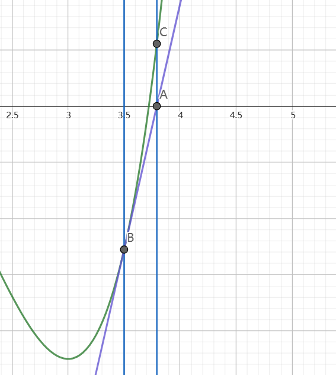

其实我们很容易发现，在一维问题当中，$g(x)=|f(x)|$的一维线搜索问题，就是求根问题，所以对于一维问题的求根来说，用探测法也可以求根

# 1. 牛顿法

牛顿法的思路在于，通过切斜与x轴的交点，作为更新点


$$
\begin{align*}
&\Large g(x)=f(x_k)+f'(x_k)(x-x_k)=0\\
&\Large x=x_k-\frac{f(x_k)}{f'(x_k)}
\end{align*}
$$
当$|f(x_k)|<\epsilon$就代表已经收敛

```python
#  牛顿法求零点
def newtonMethodForZeroPoint(x1, epsilon, func):
    """
    :param x1: 初始展开点
    :param epsilon: 收敛条件
    :param func: 函数
    :return: 返回零点的x
    """
    while True:
        x1 = torch.Tensor([x1])
        x1.requires_grad_(True)
        y = func(x1)
        if torch.abs(y) < epsilon:
            break
        else:
            grad = autograd.grad(outputs=y, inputs=x1, grad_outputs=torch.ones_like(y), create_graph=True)[0]
            x1 = x1 - y / grad
    return x1.detach().numpy()
```

