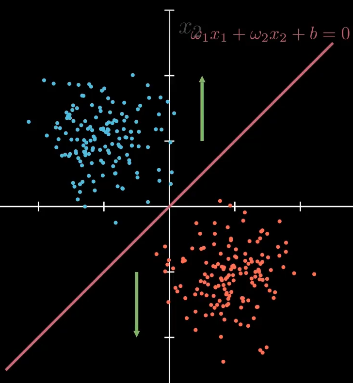
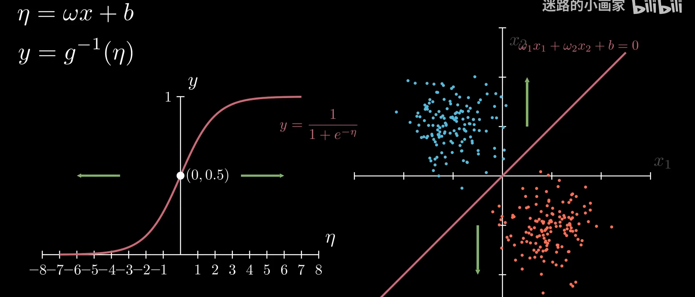
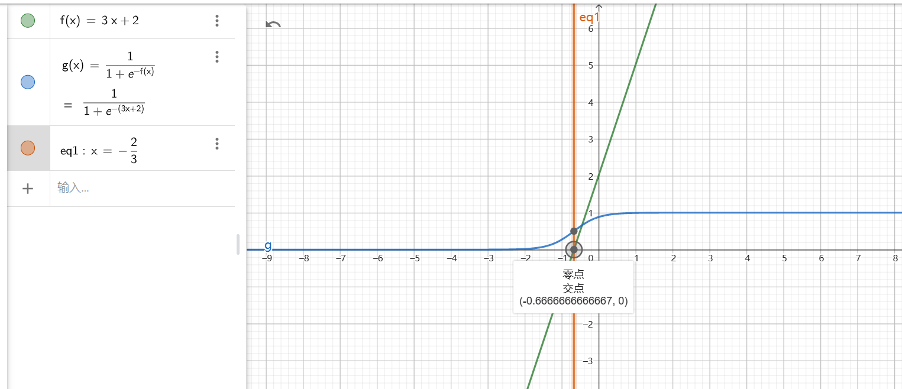
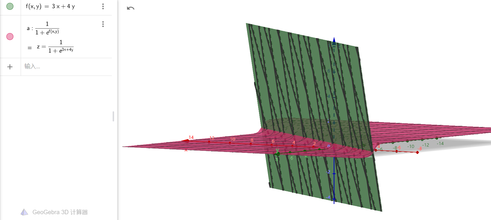
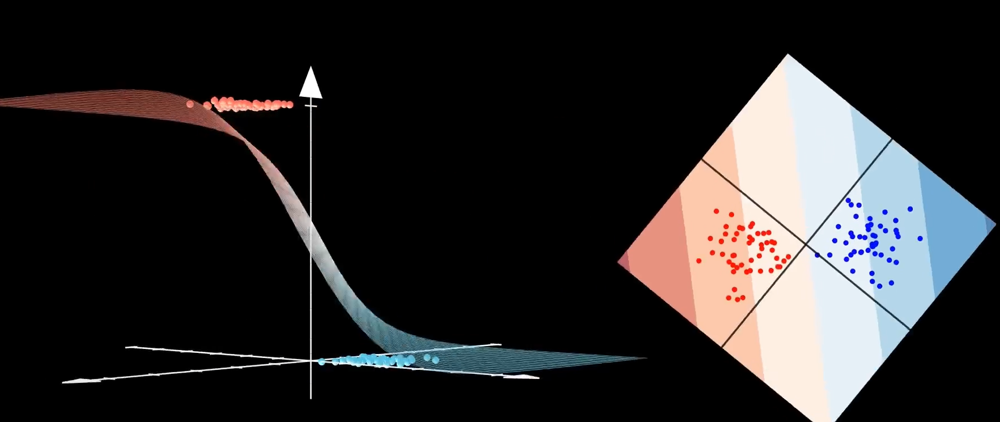
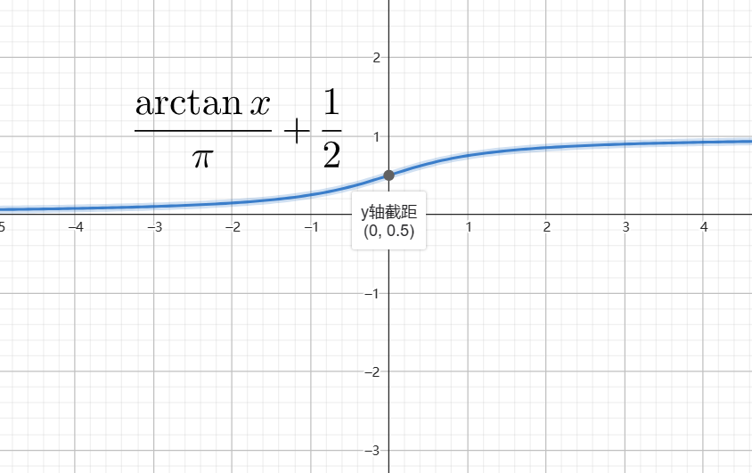
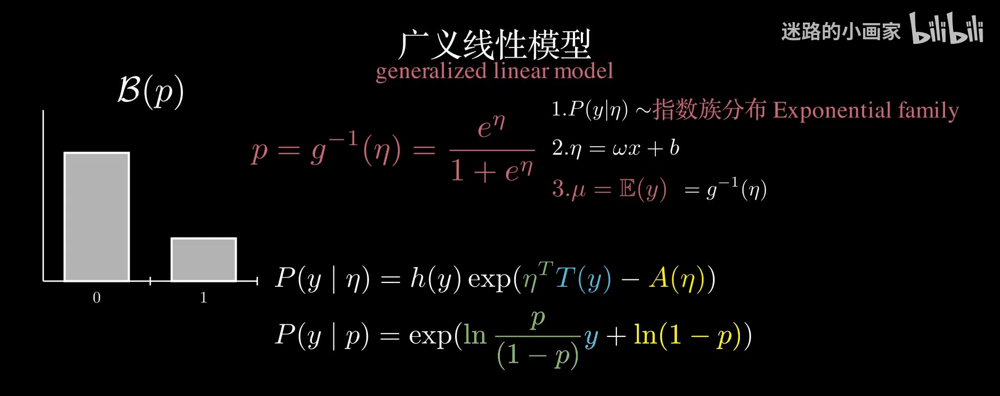

# 1. 似然函数

所谓的似然函数，就是在已经知道采样数据的分布情况下，去==估计其分布函数的参数==是什么

比如，伯努利分布。一个无限大，有无穷多球的袋子，里面有若干个0号球和若干个1号球，对于一个0-1分布来说，抽到0球和抽到1球的概率分别是：

| X      | 0        | 1          |
| ------ | -------- | ---------- |
| P{X=K} | $\theta$ | $1-\theta$ |

若我们已经抽了5个球，其中3个1球和2个0球，我们可以得到这样的一个似然函数
$$
\Large L(\theta)=\theta^3(1-\theta)^2
$$
最大似然估计的思想在于，我们认为当似然函数最大时，得到的参数是分布的参数的概率最大
$$
\Large L'(\theta)=0\to\theta=\frac{2}{5}
$$
是函数$L(\theta)$的最大值

==但要注意的是：要区分样本总体是连续型还是非连续型==

对于连续型总体来说，其似然函数为概率密度的连乘：
$$
\Large L(\theta)=L(X_1,X_2,...X_n;\ \theta)=\prod f(X,\ \theta)
$$
而对于非连续型总体来说，其似然函数为概率分布的连乘（如伯努利的例子）：
$$
\Large L(\theta)=L(X_1,X_2,...X_n;\ \theta)=\prod p(X|\theta)
$$
对于==离散样本和连续样本的主要区别在于==我们对样本分布的建模方式，我们对样本的分布的预计，是离散的分布函数（如：伯努利分布）还是连续的分布（如：高斯分布），而不在于采样点之间的连续性。

# 2. 损失函数

对于所有的算法模型，都预设了独立同分布的前提条件，而不同的分布，决定了模型的输出项

当认为分布是高斯分布的时候，高斯分布的分布范围是整个实数域，那输出也是整个实数域，当认为分布是伯努利分布的时候，则分布范围就是0-1, 等等。下面从噪声分布的假设来解读损失函数。

## 2.1 高斯分布与最小二乘损失

一般，我们将线性回归问题视为高斯分布的情况。

当我们认为噪声以高斯分布的形式出现的时候，我们可以得到这样的结论：
$$
\Large y=g(x)+\epsilon, \ \ \ \epsilon\sim N(0, \sigma^2)
$$
（注意：这个噪声项必然是均值为0的，否则这个数据都发生偏移了。）
$$
\Large \epsilon(x)=\frac{1}{\sqrt{2\pi\sigma^2}}\exp(-\frac{x^2}{\sigma^2})
$$
我们知道，高斯分布的对称轴位置概率最大，均值为0，对称轴在原点。因为观测噪声是符合高斯分布的，那么==残差也是符合高斯分布的==，于是通过给定的x观测到特定y的似然，就是残差的概率:==（没懂为什么）==
$$
\Large f(y_i|x_i)= \epsilon[y_i-g(x_i)]=\frac{1}{\sqrt{2\pi\sigma^2}}\exp[{-\frac{1}{2\sigma^2}(y_i-g(x_i))^2}]
$$

其中$\sigma$为噪声参数，与模型无关。又由于观测是独立同分布的，联合概率
$$
\begin{align*}
&\Large P(Y|X)=\prod_{i=1}^n f(y_i|x_i, \ \sigma^2)=\prod \frac{1}{\sqrt{2\pi\sigma^2}}\exp[{-\frac{1}{2\sigma^2}(y_i-g(x_i))^2}]\\
&\Large 最大似然估计\\
&\Large \to \max \ [\ln f(Y|X)]=\max \sum \ln(\frac{1}{\sqrt{2\pi\sigma^2}})+[{-\frac{1}{2\sigma^2}(y_i-g(x_i))^2}]\\
&\Large 其中\sigma与模型无关，故而不影响最大值\\
&\Large \max \sum-(y_i-g(x_i))^2 \to\max \ [\ln f(Y|X)] \\
&\Large 求最大值，就是求负数的最小值\\
&\color{red}\Large \min \sum (y_i-g(x_i))^2 \color{}\to \Large \max \sum-(y_i-g(x_i))^2 \to\max \ [\ln f(Y|X)]
\end{align*}
$$

其中$X=[x_i], Y=[y_i]$

## 2.2 伯努利分布与BCE损失

一般我们将二分类问题，认为是伯努利分布的情况。
$$
\Large B(p)=P(X=k)=p^k(1-p)^{1-k}
$$

| X      | 0    | 1    |
| ------ | ---- | ---- |
| P{X=K} | p    | 1-p  |

对于一般的线性模型有：(线性分类)
$$
\Large y=\omega x+b
$$
这个输出的范围是在实数域上，但我们预计输出只会两个，且范围在[0, 1]，和为1。由此引入了广义线性模型
$$
\begin{align}
&\Large \eta=\omega^T_{1\times n} x_{n\times 1}+b\\
&\Large y=g^{-1}(\eta)\to[0, \ 1]
\end{align}
$$
其中$g^{-1}$是反函数形式，被称为连接函数。则判别式为：
$$
\Large \omega^T_{1\times n} x_{n\times 1}+b=0
$$
我们需求是：当把特征x代入后，$\eta>0$，则认为他倾向于是类别1，$y\to1$

$\eta < 0$，则倾向于认为是类别0，$y\to 0$。当点在空间上落在判别式上，则都有可能$y\to0.5$

我们很容易想到分段函数：
$$
\Large y(\eta)=\begin{cases}
0&,\eta<0\\
0.5&,\eta=0\\
1&,\eta>0
\end{cases}
$$
但这样的函数是不连续的，不为微的。==一般我们选择的是sigmoid函数==
$$
\Large y=\frac{1}{1+e^{-\eta}}
$$

如上图所示，我们选择$\eta=\omega x+b$作为判别式。当只有一个特征值时：

我们可以看见，y=0.5的位置刚好是$\eta=0$的位置，当特征越远离判别式时，属于对应左（右）类别的概率越大

当有两个特征值时也是如此

我们将sigmoid方程带入到伯努利方程中：$\Large B(\frac{1}{1+e^{-\eta}})$
$$
\begin{align}
&\Large \begin{cases}
\max \ln[B(p)]\\
B(p)=P\{X=y_i\}=p_i^{y_i}(1-p_i)^{1-y_i}
\end{cases}\\ \\
&\Large \Longrightarrow\max \sum [y_i\ln p+(1-y_i)\ln(1-p)]\\
&\Large \ \  =\max \sum [y_i\ln \frac{p}{1-p}+\ln(1-p)]\\

\\
&\Large 我们将sigmoid代入\\
&\Large\ \ \ \max \ \ln[B(\frac{1}{1+e^{-\eta}})]\\
&\Large =\max\sum[ y_i\ln\frac{\frac{1}{1+e^{-\eta}}}{1-\frac{1}{1+e^{-\eta}}}+\ln(1-\frac{1}{1+e^{-\eta}})]\\
&\Large =\max\sum[ y_i\ln\frac{\frac{1}{1+e^{-\eta}}}{\frac{1}{1+e^\eta}}+\ln(\frac{1}{1+e^{\eta}})]\\
&\Large =\max\sum[ y_i\ln\frac{e^{\eta}(1+e^{-\eta})}{1+e^{-\eta}}+\ln(\frac{1}{1+e^{\eta}})]\\
&\Large =\max\sum y_i\eta-\ln(1+e^\eta)\\
&\Large\color{red} =- \min\sum -y_i\eta+\ln(1+e^\eta)
\end{align}
$$
这就是伯努利分布下的损失函数

但有一个问题==为什么是sigmoid函数而不是别的函数==，别的函数也可以呈现类似sigmoid一样的性质，如：
$$
\Large \frac{\arctan x}{\pi}+\frac{1}{2}
$$

sigmoid函数是广义线性模型中得出

