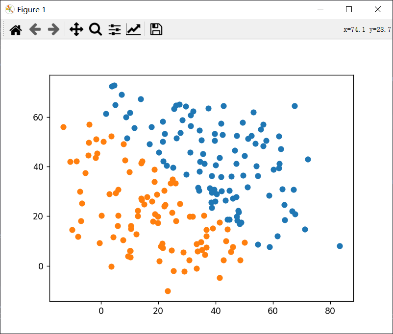
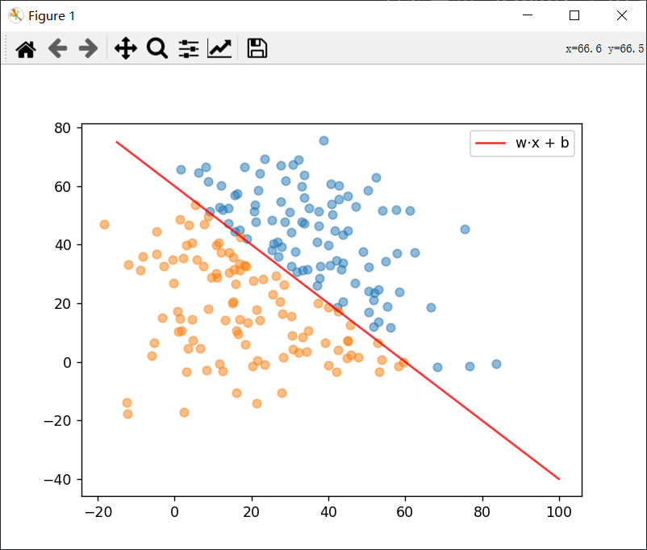
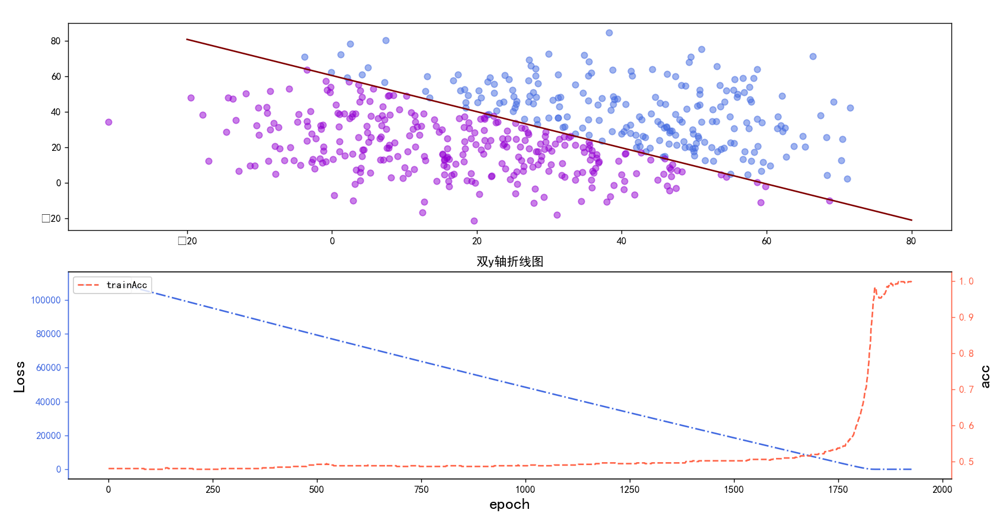
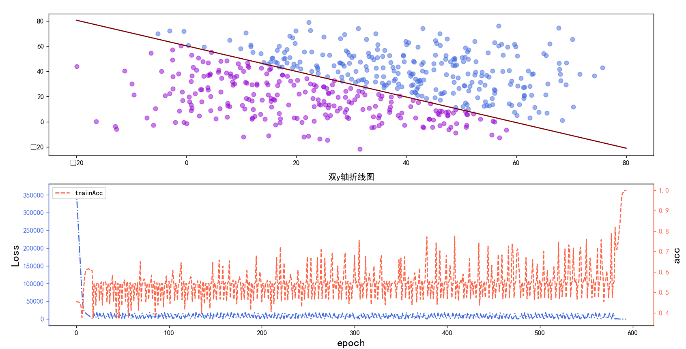
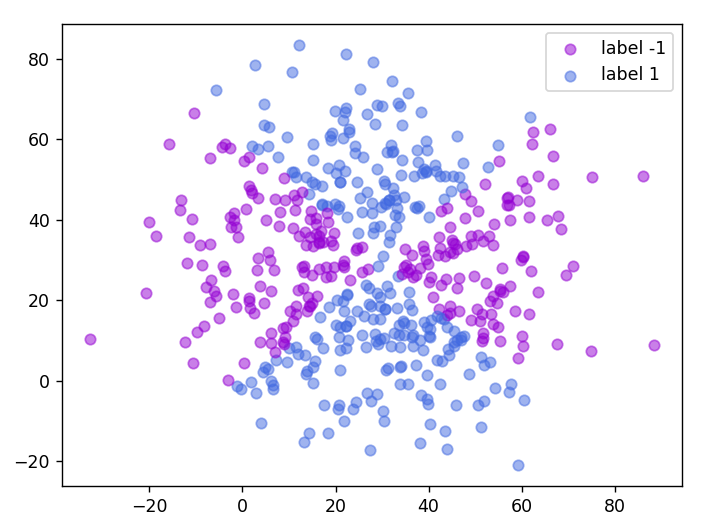
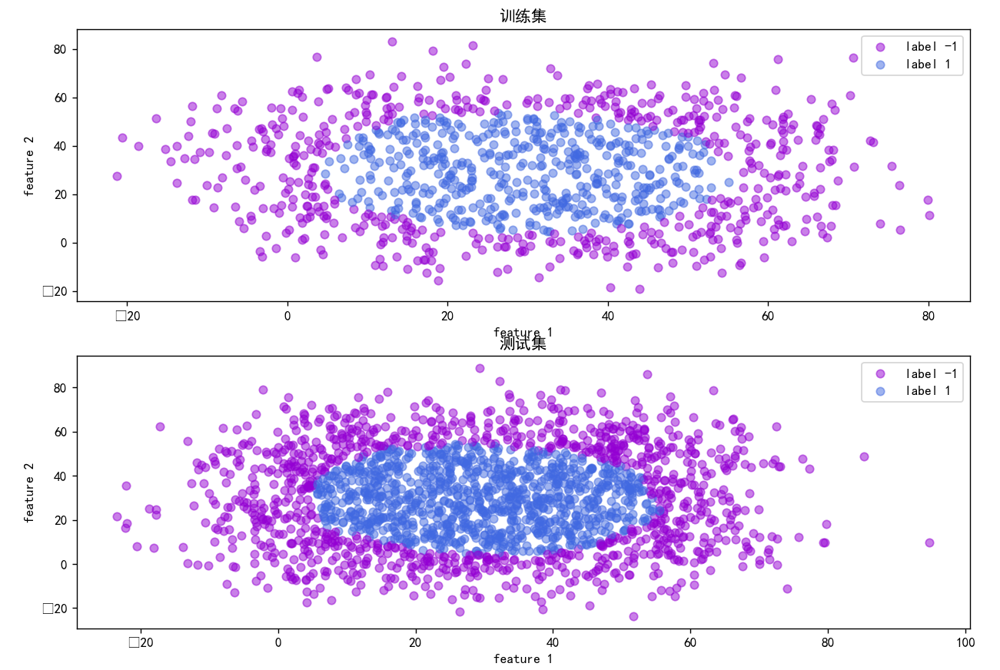
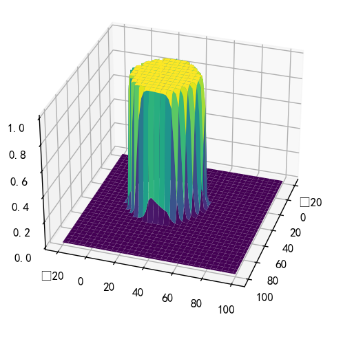

# 1. 感知机

## 1.1 概念

感知机（perceptron）是二类分类的==线性分类==模型，其输入为实例的特征向量，输出为实例的类别，取+1 和–1 二值．令特征空间为：$X \subseteq R^n$，输出空间为$\{+1, -1\}$. 假设某数据集有两个特征：



所谓感知机就是通过一个线性函数来分割数据，以完成分了：
$$
\Large f(x= \omega \cdot \mathrm{feature}+b)=\begin{cases}
1&,x>0\\
-1&,x\le 0
\end{cases}
$$
可视化之后如图所示：



在判别式之下，的为类别-1， 在判别式之上，为类别1

## 1.2 学习策略

损失函数的另一个选择是误分类点到超平面*S* 的总距离：
$$
\Large \frac{1}{\| w\|}|w \cdot \mathrm{feature} +b|
$$
其中$\|w\|$为L2范数，对于平面直角坐标系来说为：
$$
\Large \frac{A\cdot\mathrm{feature}_1 +B\cdot \mathrm{feature}_2+C}{\sqrt{A^2+B^2}}
$$
由感知机公式$\large f(x= \omega \cdot \mathrm{feature}+b)=\begin{cases}
1&,x>0\\
-1&,x\le 0
\end{cases}$可知，对于误分类的点，有：
$$
\begin{align*}
&\Large \ \ \ \ \ \ \ \  \mathrm{trueLabel}_{i}(w\cdot \mathrm{feature}_i+b)<0\\
\end{align*}
$$
为了使得损失函数最接近于0，并且便于最优化，我们可以写成：
$$
&\Large -1\cdot \mathrm{trueLabel}_{i}(w\cdot \mathrm{feature}_i+b)>0\\
$$
下面将$\mathrm{trueLabel}_i\ \ \ \mathrm{feature}_i$  写为  $y_i\ \ \ x_i$

这样，假设超平面 *S* 的误分类点集合为 *M*，那么所有误分类点到超平面 *S* 的总距离为：
$$
\Large -\frac{1}{\| w\|}\sum_{x_i\in M}y_i(w\cdot x_i+b)
$$
其中$\large \frac{1}{\|w\|}$不影响损失函数的优化，故而可以写成：
$$
\Large L(w, b)=-\sum_{x_i \in M}y_i\cdot(w\cdot x_i+b)
$$
损失函数梯度为：
$$
\begin{align*}
&\Large \nabla_w L(w, b)=-\sum_{x_i\in M}y_i\cdot x_i\\
&\Large \nabla_b L(w, b)=-\sum y_i\\
\end{align*}
$$
随机选取一个误分类点$(x_i,y_i)$，对参数进行更新：
$$
\begin{align*}
&\Large w\leftarrow w-[-\eta \cdot\nabla_wL(w,b)]=w+\eta\cdot\nabla_wL(w,b)\\
&\Large b\leftarrow b+\eta\cdot\nabla_bL(w,b)
\end{align*}
$$
其中$\leftarrow$是赋值的意思，$\eta$是学习率

训练结果：



<center><p>优化方法为Adam</p></center>



<center><p>优化方法为SGD</p></center>

```python
import torch
import numpy as np
from torch import autograd
import matplotlib.pyplot as plt
from utils.dataPlot import dataShow2


def model(features, **kwargs):
    w = kwargs['w']
    b = kwargs['b']
    tmp = torch.matmul(features, w) + b
    for i in range(len(tmp)):
        if tmp[i] > 0:
            tmp[i] = 1
        else:
            tmp[i] = -1
    return tmp


def LossFunc(features, labels, **kwargs):
    w = kwargs['w']
    b = kwargs['b']
    tmp = torch.matmul(features, w) + b
    return -1 * torch.sum(torch.matmul(labels, (tmp)))


def dataIter(batch_size, features, labels):
    num_examples = len(features)
    indices = list(range(num_examples))  # 打乱下标的顺序，随机选
    np.random.shuffle(indices)
    for i in range(0, num_examples, batch_size):
        batch_size_indices = indices[i: min(i + batch_size, num_examples)]
        yield features[batch_size_indices], labels[batch_size_indices]


def SGD(params, learning_rate, batch_size, features, labels):
    with torch.no_grad():
        for param in params:
            param -= learning_rate * param.grad / batch_size
            param.grad.zero_()


def train(features, labels, epochs=100, **kwargs):
    w = kwargs['w']
    b = kwargs['b']
    batch_size = 512
    bestLoss = 1000000
    learning_rate = 0.1
    lossList = []
    acc = []
    # optim = torch.optim.Adam([w, b], lr=learning_rate)
    for epoch in range(epochs):
        for feature, label in dataIter(batch_size, features, labels):
            # y = model(feature, w=w, b=b)
            # optim.zero_grad()
            yhat = model(feature, w=w, b=b).view(batch_size)
            rightNot = yhat * label
            indices = (rightNot < 0).nonzero()
            indices = indices.view(len(indices))
            acc.append((batch_size - len(indices)) / batch_size)
            loss = LossFunc(feature[indices], label[indices], **kwargs)
            loss.sum().backward()
            SGD([w, b], learning_rate=learning_rate, batch_size=batch_size, features=feature[indices], labels=label[indices])
            # optim.step()
            if bestLoss > loss:
                wBest, bBest = w, b
                bestLoss = loss
            lossList.append(float(loss))
            print("epoch:{}, loss:{}, acc:{}".format(epoch, loss, acc[len(acc) - 1]))
            if loss < 100 or acc[len(acc) - 1] > 0.8:
                learning_rate=0.01
            elif loss < 50 or acc[len(acc) - 1] > 0.9:
                learning_rate = 0.01
            if loss == 0:
                return wBest.detach().numpy().reshape(len(wBest)), bBest.detach().numpy().reshape(len(bBest)), lossList, acc
    return wBest.detach().numpy().reshape(len(wBest)), bBest.detach().numpy().reshape(len(bBest)), lossList, acc


if __name__ == '__main__':
    # w = torch.tensor([1, 1], requires_grad=True, dtype=torch.float64)
    w = torch.normal(0, 20, size=(2, 1), requires_grad=True, dtype=torch.float64)
    # b = torch.tensor([-60], requires_grad=True, dtype=torch.float64)
    b = torch.normal(0, 20, size=(1, 1), requires_grad=True, dtype=torch.float64)
    features = torch.from_numpy(np.random.randint(0, 60, size=(512, 2)) + np.random.normal(0, 10, size=(512, 2)))
    label = []
    label1Features, label2Features = [], []
    for i in range(len(features)):
        if features[i][0] + features[i][1] - 60 > 0:
            label.append(1)
        else:
            label.append(-1)
    labels = torch.from_numpy(np.array(label, dtype=np.float64))
    w, b, lossList, acc = train(features, labels, w=w, b=b, epochs=10000)
    print(w)
    print(b)
    x = np.linspace(-20, 80, 100)
    y = -1 * x * w[0] / w[1] - b / w[1]
    plt.figure(figsize=(16, 8))
    plt.subplot(2, 1, 1)
    for i in range(len(features)):
        if labels[i] == 1:
            color = "royalblue"
        else:
            color = "darkviolet"
        plt.scatter(features[i][0], features[i][1], c=color, alpha=0.5)
    plt.plot(x, y, color="maroon")
    plt.subplot(2, 1, 2)
    ax = plt.gca()
    dataShow2(lossList=lossList, acc=acc, ax1=ax)
```


# 2. 多层感知机

对于多分类，非线性的分类问题，感知机束手无策，特别是异或问题



于是为了解决这些问题提出了多层感知机，特征经过一层的多个感知机，感知机的结果作为下一层的输入，经过sigmoid或者softmax等激活函数，得到最终结果



如下面两张图所示，训练后得到的feature1 和 feature2 和label的映射关系（z轴是label）：



```python
import torch
from torch import nn
import numpy as np
import matplotlib.pyplot as plt
from utils.dataLoad import dataIter
from scipy import interpolate


def initialize(net):
    net[0].weights = torch.normal(0, 0.1, size=(2, 8), requires_grad=True, device=device)
    net[2].weights = torch.normal(0, 0.1, size=(8, 256), requires_grad=True, device=device)
    net[4].weights = torch.normal(0, 0.1, size=(256, 8), requires_grad=True, device=device)
    net[6].weights = torch.normal(0, 0.1, size=(8, 2), requires_grad=True, device=device)
    net.to(device)
    return net


def train(net, features, test, labels):
    trainer = torch.optim.Adam(net.parameters(), lr=0.001)
    lossFunc = nn.BCEWithLogitsLoss()
    epochs = 300
    batch_size = 64
    bestLoss = 10000
    for epoch in range(epochs):
        for feature, label in dataIter(batch_size, features, labels):
            yhat = net(feature).view(batch_size)
            # print(yhat)
            loss = lossFunc(yhat, label)
            trainer.zero_grad()
            loss.backward()
            trainer.step()
            print("epoch: {}, loss: {}".format(epoch, loss))
            if loss < bestLoss:
                bestLoss = loss
                state = net.state_dict()  # 备份模型的状态
    print("best loss: {}".format(bestLoss))
    bestModel = nn.Sequential(nn.Linear(2, 8),
                              nn.ReLU(),
                              nn.Linear(8, 256),
                              nn.ReLU(),
                              nn.Linear(256, 8),
                              nn.ReLU(),
                              nn.Linear(8, 1),
                              nn.Sigmoid())
    bestModel.load_state_dict(state)  # 加载Loss最好的模型
    bestModel.to(device)
    Y = bestModel(features).view(len(labels))
    '''
    Y = torch.where(Y > 0.5, torch.tensor(1, device=device), torch.tensor(0, device=device))
    将>0.5的变成true，true变成1，反之变成0
    right = torch.where(Y == labels, torch.tensor(1, device=device), torch.tensor(0, device=device)) 这个同理
    '''
    Y = torch.where(Y > 0.5, torch.tensor(1, device=device), torch.tensor(0, device=device))
    right = torch.where(Y == labels, torch.tensor(1, device=device), torch.tensor(0, device=device))
    print("准确率：{}%".format(torch.sum(right) / len(right) * 100))

    plt.rcParams['font.sans-serif'] = ['SimHei']
    plt.figure(figsize=(12, 12))
    plt.subplot(2, 1, 1)
    plt.title("训练集")
    features = features.to('cpu')
    draw(features, Y)
    plt.legend()
    plt.xlabel("feature 1")
    plt.ylabel("feature 2")

    Yhat = bestModel(test)
    Yhat = torch.where(Yhat > 0.5, torch.tensor(1, device=device), torch.tensor(0, device=device))
    test = test.to('cpu')
    plt.subplot(2, 1, 2)
    plt.title("测试集")
    draw(test, Yhat)
    plt.xlabel("feature 1")
    plt.ylabel("feature 2")
    plt.legend()
    plt.show()
    return bestModel

def draw(features, labels):
    flag1, flag2 = False, False
    for i in range(len(features)):
        if labels[i] == 1:
            color = "royalblue"
            L = "label 1"
        else:
            color = "darkviolet"
            L = "label 0"
        # plt.scatter(features[i][0], features[i][1], c=color, alpha=0.5)
        if flag1 is False and L == "label 0":
            plt.scatter(features[i][0], features[i][1], c=color, alpha=0.5, label=L)
            flag1 = True
        elif flag2 is False and L == "label 1":
            plt.scatter(features[i][0], features[i][1], c=color, alpha=0.5, label=L)
            flag2 = True
        elif flag1 is True and flag2 is True:
            plt.scatter(features[i][0], features[i][1], c=color, alpha=0.5)


if __name__ == '__main__':
    device = torch.device("cuda:0" if torch.cuda.is_available() else "cpu")
    test = np.random.randint(0, 60, size=(1024 * 2, 2)) + np.random.normal(0, 10, size=(1024 * 2, 2))
    test = torch.tensor(test, device=device, dtype=torch.float32)
    features = np.random.randint(0, 60, size=(1024, 2)) + np.random.normal(0, 10, size=(1024, 2))
    features = torch.tensor(features, device=device, dtype=torch.float32)
    label = []
    for i in range(len(features)):
        if (features[i][0] - 30) ** 2 + (features[i][1] - 30) ** 2 - 26 ** 2 < 0:
            label.append(1)
        else:
            label.append(0)
    labels = torch.tensor(label, device=device, dtype=torch.float32)

    net = nn.Sequential(nn.Linear(2, 8),
                        nn.ReLU(),
                        nn.Linear(8, 256),
                        nn.ReLU(),
                        nn.Linear(256, 8),
                        nn.ReLU(),
                        nn.Linear(8, 1),
                        nn.Sigmoid())
    net = initialize(net)
    bestModel = train(net, features, test, labels)
    '''
    下面是用来绘制feature和label的映射空间关系
    '''
    F1 = np.linspace(-20, 100, 64)
    F2 = np.linspace(-20, 100, 64)

    # 使用 meshgrid 生成二维坐标矩阵
    F1, F2 = np.meshgrid(F1, F2)
    F1_, F2_ = F1.reshape((len(F1) ** 2, 1)), F2.reshape((len(F2) ** 2, 1))
    allFeatures = np.column_stack((F1_, F2_))
    allFeatures = torch.tensor(allFeatures, device=device, dtype=torch.float32)
    allLabels = bestModel(allFeatures)
    allLabels = allLabels.to('cpu')
    allLabels = allLabels.reshape((len(F1), len(F2))).detach().numpy()
    print(allLabels.shape)
    func = interpolate.Rbf(F1, F2, allLabels, function='multiquadric')
    zi = func(F1, F2)
    # print(zi)
    fig = plt.figure()
    ax = fig.add_subplot(111, projection='3d')
    ax.plot_surface(F1, F2, zi, cmap='viridis')
    # ax.scatter(F1, F2, allLabels, c='r')
    plt.show()
```


