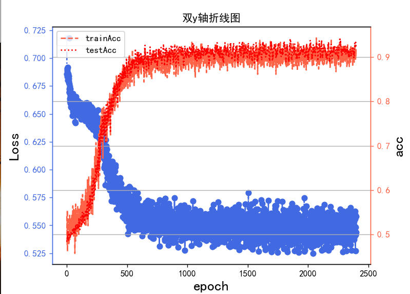
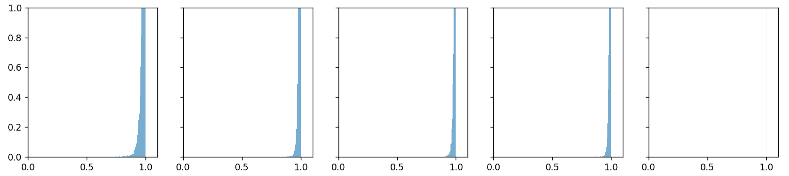

# 1. 误差

1. 训练误差：模型在训练集上的误差损失
2. 泛化误差：模型在验证集上的误差损失

验证集和测试集的区别

验证集是用来用验证，模型的超参数是否取得合适的。一般将数据集7:3分为训练集，验证集

测试集是给不同模型使用，且每个模型只能使用一次的，是不能用来调节超参数的。是模型之间的评价指标


# 2. 交叉验证

K折交叉验证是指：shuffle数据集之后，将数据集分成K分，编号1 ~ K，以此取第1,2,3...K部分作为验证集，其余作为训练集进行训练和验证

将精度取平均，以此避免模型数据集本身的分布情况影响最终结果


# 3. 过拟合与欠拟合

过拟合指的是：在训练集上表现优异但在验证集上表现不佳的情况。

欠拟合指的是：在所有数据集上表现都不佳


<center><p>欠拟合的图像.jpg</p></center>


<center><p>过拟合的图像.jpg</p></center>


<center><p>预期拟合</p></center>

# 3. L1 / L2正则化的理解

所谓正则化指的是，能降低模型过拟合程度的方法。比如对于计算机视觉领域的图像增强也是一种正则化。

L1 / L2 正则化的思路则是通过让损失函数偏离其极低值以避免过度拟合于训练集而实现的。

L1 正则化的损失函数：
$$
\Large L_1(w)=L(y, f(x, w))-\lambda\|w\|_1=L(y, f(x, w))-\lambda\cdot \sum|w_i|
$$
其与原损失函数的关系是：


<center><p>损失函数与L1范数</p></center>

其中的曲线是损失函数的等高线。通过公式我们可以知道，当我们寻找L1正则化损失函数的极小值时他会收到，L1 范数的牵制，使得极小值偏离原损失函数极小值。


L2 正则化损失函数：
$$
\Large L_2(w)=L(y,f(x,w))-\lambda \|w\|_2
$$
损失函数与L2范数的关系是：


<center><p>损失函数与L2范数</p></center>


## 3.1 过拟合的由来与权重衰减

==过拟合的一个原因是因为权重值过大。==权重和损失函数值之间是多对一的关系，即多个权重值可能可以对应同一个损失函数结果。

损失函数描述的是模型接近训练数据集中，特征和标签的所描述的概率分布的接近程度。

当权重值过大时，如果测试数据集出现了训练数据集没有出现过的噪声，或噪声比训练数据集大时，过大的权重可能会放大这种噪声，使得最终结果偏离预期，表现为在训练集上极佳但测试集上不如人意。这种过大的权重值，在训练时，在训练集上表现的损失函数仍然是低的。


这是就需要进行权重衰减。对于 L2 正则化来说，其等价于：
$$
\Large L_2(w)=L(y,f(w,x))-\lambda \|w\|_2 \Leftrightarrow \hat{L}_2(w)=L(y,f(w,x))-\frac{\alpha}{2}w^T w
$$
权重的更新方程为：
$$
\begin{align}
&\Large w=w-\eta\nabla_w\hat{L}_2(w)\\
&\Large \ \ \ = w-\eta\cdot(\nabla_wL -\alpha w)\\
&\Large \ \ \ =(1-\eta  \alpha) \cdot w-\eta \cdot \nabla_wL\\
\end{align}
$$
我们对比原始损失函数的权重更新方式
$$
\Large w=w-\eta \nabla_wL
$$
我们可以发现，在权重更新上增加了一个系数，通过调节$$\alpha$$来进行权重更新的调节


## 3.2 贝叶斯学派与正则化

### 3.2.1 频率学派最大似然估计的缺陷

损失函数的由来，是概率学派的最大似然估计而得到的。我们已知一系列数据集$X =\{X_1...X_n\}$，希望得到这组数据集其概率分布的参数$\theta$，那么我们是在求
$$
\Large \arg\max P(\theta | X)
$$
即，在已知X的情况下，$\theta$取什么值时的概率最大。但这个条件概率，我们是求不出来的。数据集X 本身涵盖的信息是：
$$
\Large P(X|\theta )
$$
事件本身的参数是固定的（但位置），数据集给出的是在这个固定的参数的条件下，X的发生概率是什么.

以离散型概率分布举例，似然函数是:
$$
\Large L(\theta)=\prod P(X_i | \theta)
$$
例如伯努利分布，A有n个，概率为$\theta$，B有m个，概率为$1-\theta$，那么似然函数就是
$$
\Large L(\theta)=\theta^n \cdot \theta^m
$$
那么当最大似然估计的一个假设就是：
$$
\Large \textcolor{red}{[} \arg\max L(\theta):=\arg\max \prod P(X_i | \theta) \ \textcolor{red}]=\arg\max \prod P(\theta |X_i)
$$
但很显然
$$
\Large P(\theta |X)\neq P(X|\theta)
$$
即使是求$\arg\max$，式子也未必等价，即最终结果$\theta$其实是不等的

而另一个假设是，我们假设的认为
$$
\Large \theta = \arg\max L(\theta)
$$
所以==最大似然估计是建立在双层假设之上的==


### 3.2.2 最大后验估计与正则化

贝叶斯公式可以得到：
$$
\Large P(\theta |X)=\frac{P(X,\theta)}{P(X)}=\frac{P(X|\theta)}{P(X)}P(\theta)
$$
那么我们可以得到：
$$
\Large f_X(\theta)=\prod \frac{P(X_i|\theta)}{P(X_i)}P(\theta)
$$
对其进行一个假设：
$$
\Large \theta = \arg\max f_X(\theta)
$$
对于这个公式的求解有：
$$
\begin{align}
&\Large \arg\max f_X(\theta)=\arg\max \frac{L(\theta)=\prod P(X_i|\theta)(最大似然估计)}{\prod P(X_i)}\prod P(\theta) \\
\end{align}
$$
其中P（X）与参数无关，可以忽略，最终的argmax是等价的
$$
\Large \theta =  \arg\max L(\theta)\cdot \prod P(\theta)
$$
其中的$L(\theta)$是前面的最大似然估计

对于深度学习模型来说，==最大似然估计==：

似然函数为：
$$
\Large L(w)=\prod P(X,Y|w)
$$
参数为：
$$
\begin{align}
&\Large w = \arg\max L(w)\Leftrightarrow w=\arg\max \log L(w) \\
&\Large \ \ \ \ \ \ \ \ \ \ \ \ \ \ \ \ \ \ \ \ \ \ \ \ \ \ \ \ \ \ \   \Leftrightarrow w=\arg\max \sum \log P(X,Y|w)\\
&\Large \ \ \ \ \ \ \ \ \ \ \ \ \ \ \ \ \ \ \ \ \ \ \ \ \ \ \ \ \ \ \   \Leftrightarrow w=\arg\max \sum\log P(Y|X,w)
\end{align}
$$
其中的第二行到第三行的推导如下：
$$
\begin{align}
&\Large P(X,Y|w)=\frac{P(X,Y,w)}{P(w)}=\frac{P(Y|X,w)\cdot P(X,w)}{P(w)}\\
&\Large \ \ \ \ \ \ \ \ \ \ \ \ \ \ \ \ \ \  =\frac{P(Y|X,w)\cdot P(X|w)\cdot P(w)}{P(w)}\\
&\Large \ \ \ \ \ \ \ \ \ \ \ \ \ \ \ \ \ \ = P(Y|X,w)\cdot P(X|w)
\end{align}
$$
其中，因为X是权重，w是参数，两者是独立的，所以有：
$$
\Large P(Y|X,w)\cdot P(X|w)=P(Y|X,w)\cdot P(X)
$$
所以可以得出结果：
$$
\Large P(X,Y|w)=P(Y|X,w)\cdot P(X)
$$
而由P(X)与w无关，故而有：
$$
\Large w=\arg\max \sum \log P(X,Y|w) \Leftrightarrow \textcolor{red}{w=\arg\max\sum\log P(Y|X,w)}
$$


而对于==最大后验估计==来说：
$$
\begin{align}
&\Large w = \arg\max L(w)\cdot \prod P(w) \Leftrightarrow w=\arg\max  \ \log L(w)+\log \prod P(w)\\
\end{align}
$$
当w符合连续型随机变量时：
$$
\Large w=\arg\max\log L(w)+\log\prod f(w)
$$
其中$f(w)$为概率密度函数。在使用最大后验估计的时候，要进行先验假设。

当将w的先验假设设置为正态分布的时候，即我们认为w符合正态分布$w\sim N(0,\sigma^2)$时，可以得到：
$$
\begin{align}
&\Large w=\arg\max\log L(w)+\log\prod\frac{1}{\sqrt{2}\sigma} e^{(\frac{w-0}{\sqrt{2}\sigma})^2}\\
&\Large w=\arg\max\textcolor{red}[\log L(w)+\sum\log\frac{1}{\sqrt{2}\sigma}+\sum\frac{w^2}{\sqrt{2}\sigma}\textcolor{red}]\\
&\Large\Leftrightarrow w=\arg\max\textcolor{red}{\log L(w)}+\frac{1}{\sqrt{2}\sigma}\textcolor{blue}{\sum w ^2}
\end{align}
$$
我们可以发现，其损失函数结构与L2正则化结构完全一致：
$$
\Large L_2=L(w)+\lambda\cdot \|w\|_2\Leftrightarrow \log L(w)+\lambda \sum w^2
$$


拉普拉斯分布：
$$
\Large f(x;\mu,b) = \frac{1}{2b} \exp \left( - \frac{|x-\mu|}{b} \right)
$$
当我们认为w符合拉普拉斯分布，$w\sim \mathrm{Laplace}(0,b)$时可以得到：
$$
\begin{align}
&\Large w=\arg\max\log L(w)+\log\prod\frac{1}{2b} \exp{\frac{|x|}{b}}\\
&\Large w=\arg\max\textcolor{red}[\log L(w)+n\sum\frac{1}{2b}+\sum\frac{|x|}{b}\textcolor{red}]\\
&\Large\Leftrightarrow w=\arg\max\textcolor{red}{\log L(w)}+\frac{1}{2b}\textcolor{blue}{\sum|w|}
\end{align}
$$
这与L1 正则化的结构相同

即我们也可以得出结论，当我们选择L1 正则化或L2 正则化后，我们选择的是，我们认为w符合XXX分布的前提下的最大后验估计


# 4. dropout正则化

> Dropout is a technique that addresses both these issues. It prevents overfitting and provides a way of approximately combining exponentially many different neural network architectures efficiently
>
> Dropout是一种解决这两个问题的技术。它可以防止过度拟合，并提供了一种近似地以指数方式有效组合许多不同神经网络架构的方法。
>
> ——《Dropout: A Simple Way to Prevent Neural Networks from Overfitting》

方法是在训练过程中，每个epoch随机地将神经元从网络模型中剔除，不进行前向传播也不进行反向传播，而在测试的时候，不进行dropout。这么做是因为，将dropout应用于神经网络相当于从中采样一个“稀疏”网络。稀疏网络由所有在dropout中幸存的单元组成。一个有n个单元的神经网络可以看作是$2^n$个可能的稀疏神经网络的集合。这些网络都共享权重，因此参数的总数仍然是O（$2^n$）或更少。对于每个训练案例的每次呈现，都会对一个新的稀疏网络进行采样和训练。因此，==训练一个具有dropout的神经网络可以被看作是训练一个具有广泛权重共享的$\color{black}2^n$个稀疏网络的集合，其中每个稀疏网络很少训练==；但在测试的时候，将每个稀疏网络的结果求平均的做法是费时费力的，最n好的combination方法就是，在测试的时候不进行dropout。


$$
\begin{align*}
&\Large r_j^{l}\sim \mathrm{bernoulli}(p)\\
&\Large \widetilde{y}^{(l)}=r^{(l)}\cdot y^{(l)}\\
&\Large z_i^{(l+1)}=w_i^{(l+1)}\cdot \widetilde{y}^{(l)}+b_i^{(l+1)}\\
&\Large y_i^{(l+1)}=f(z_i^{(l+1)})
\end{align*}
$$
神经网络过拟合与每一层都依赖于前一层激活值相关，称这种情况为“共适应性”。作者认为，暂退法会破坏共适应性，就像有性生殖会破坏共适应的基因一样。作者提到，这也可以认为是一种在每一层加上噪声，那么加上什么噪声呢？一种思路是加上无偏噪声，即：
$$
\Large \widetilde{y}=\begin{cases}
0&概率为p\\
\frac{y}{1-p}&其他
\end{cases}
$$
由此可以得到:$E(\widetilde{y})=y$

```python
def dropoutLayer(y, dropout):
    assert 0 <= dropout <= 1
    if dropout == 0:
        return 0
    elif dropout == 1:
        return y
    mask = (torch.rand(y.shape) > dropout).float()
    '''
    torch.rand是均匀分布的， rand > dropout 就是有1-dropout的概率得到1，dropout的概率得到0
    y * mask得到一部分是0，一部分是yi
    然后 / 1-dropout使得其变成无偏的
    '''
    return y * mask / (1 - dropout)
```


==感觉对最后收敛有一定效果，但对于准确率的最后提升比较有限==



<center><p>应用dropout的结果</p></center>


<center><p>未使用dropout的结果</p></center>

```python
import torch
import numpy as np
from torch import nn
from scipy import interpolate
import matplotlib.pyplot as plt
from utils.classModel import model
from utils.dataLoad import dataIter
from utils.dataPlot import dataShow3


if __name__ == '__main__':
    device = torch.device('cuda:0' if torch.cuda.is_available() else 'cpu')
    trainFeatures = np.random.randint(0, 80, size=(2048, 2)) + np.random.normal(0, 20, size=(2048, 2))
    trainFeatures = torch.tensor(trainFeatures, device=device, dtype=torch.float32)
    testFeatures = np.random.randint(0, 80, size=(1024, 2)) + np.random.normal(0, 20, size=(1024, 2))
    testFeatures = torch.tensor(testFeatures, device=device, dtype=torch.float32)

    trainLabels = []
    testLabels = []
    for feature in trainFeatures:
        rand1, rand2 = torch.rand(2)
        if (feature[0] - 30) ** 2 + (feature[1] - 30) ** 2 - 39 ** 2 < 0:
            if (feature[0] - 30) ** 2 + (feature[1] - 30) ** 2 - 34 ** 2 > 0 and rand1 > 0.5:
                trainLabels.append(0)
            else:
                trainLabels.append(1)
            # trainLabels.append(1)
        elif (feature[0] - 30) ** 2 + (feature[1] - 30) ** 2 - 39 ** 2 > 0:
            if (feature[0] - 30) ** 2 + (feature[1] - 30) ** 2 - 44 ** 2 < 0 and rand2 > 0.5:
                print("yes")
                trainLabels.append(1)
            else:
                trainLabels.append(0)
            # trainLabels.append(0)
    for feature in testFeatures:
        if (feature[0] - 30) ** 2 + (feature[1] - 30) ** 2 - 39 ** 2 < 0:
            testLabels.append(1)
        elif (feature[0] - 30) ** 2 + (feature[1] - 30) ** 2 - 39 ** 2 > 0:
            testLabels.append(0)

    trainLabels = torch.tensor(trainLabels, device=device, dtype=torch.float32)
    testLabels = torch.tensor(testLabels, device=device, dtype=torch.float32)
    print(len(trainLabels))
    print(len(trainLabels))
    print("1 的个数：{}".format(torch.sum((trainLabels == 1).float())))
    print("0 的个数：{}".format(torch.sum((trainLabels == 0).float())))

    # dataShow3(trainFeatures.to('cpu'), trainLabels.to('cpu'))
    # plt.show()

    net = model(dropoutOpen=False)
    bestModel = net.train(trainFeatures=trainFeatures, testFeatures=testFeatures, trainLabels=trainLabels
                          , testLabels=testLabels, batch_size=512, epochs=600)

    '''
        下面是用来绘制feature和label的映射空间关系
        '''
    F1 = np.linspace(-20, 100, 64)
    F2 = np.linspace(-20, 100, 64)

    # 使用 meshgrid 生成二维坐标矩阵
    F1, F2 = np.meshgrid(F1, F2)
    # 将meshgrid的结果拉直然后合并写成类似features的形式，即让点均匀的铺面整个feature1， feature2平面
    F1_, F2_ = F1.reshape((len(F1) ** 2, 1)), F2.reshape((len(F2) ** 2, 1))
    allFeatures = np.column_stack((F1_, F2_))

    #  将合并的结果放入模型预测
    allFeatures = torch.tensor(allFeatures, device=device, dtype=torch.float32)
    allLabels = bestModel(allFeatures)
    allLabels = allLabels.to('cpu')
    # 将预测结果重新合并成meshgrid的矩阵形式
    allLabels = allLabels.reshape((len(F1), len(F2))).detach().numpy()
    print(allLabels.shape)

    #  插值拟合，得到近似的特征和类别的空间关系
    func = interpolate.Rbf(F1, F2, allLabels, function='multiquadric')
    zi = func(F1, F2)
    # print(zi)
    # 绘制特征空间
    fig = plt.figure()
    ax = fig.add_subplot(111, projection='3d')
    ax.plot_surface(F1, F2, zi, cmap='viridis')
    plt.show()
```


网络结构

```python
Sequential(
  (0): Linear(in_features=2, out_features=8, bias=True)
  (1): ReLU()
  (2): Linear(in_features=8, out_features=512, bias=True)
  (3): ReLU()
  (4): Linear(in_features=512, out_features=1024, bias=True)
  (5): ReLU()
  (6): Linear(in_features=1024, out_features=2048, bias=True)
  (7): ReLU()
  (8): Linear(in_features=2048, out_features=1024, bias=True)
  (9): ReLU()
  (10): Linear(in_features=1024, out_features=512, bias=True)
  (11): ReLU()
  (12): Linear(in_features=512, out_features=8, bias=True)
  (13): ReLU()
  (14): Linear(in_features=8, out_features=1, bias=True)
  (15): Sigmoid()
)
```


# 5. 梯度消失和梯度爆炸

1. **梯度消失（Gradient Vanishing）：**
   - **定义：** 在反向传播过程中，梯度逐渐变小，最终趋近于零。这导致网络的浅层参数更新很小，几乎不发生变化，因此浅层网络学习得非常缓慢，甚至停滞。
   - **原因：** 主要是由于链式法则的连乘效应。当网络很深时，梯度在每一层都要乘以权重矩阵的转置，导致梯度逐渐缩小；亦或者是因为激活函数进入==饱和状态==使得==梯度接近于0==，使得那一层无法进行参数的修改和学习
   - **影响：** 梯度消失使得网络难以学习深层次的特征表示，限制了网络的表达能力。
   
   
   
   <center><p>梯度消失</p></center>
   
   由图可见，梯度消失，反向传播过层中梯度全为0
   
2. **梯度爆炸（Gradient Exploding）：**
   
   - **定义：** 在反向传播过程中，梯度逐渐变大，甚至呈指数级增长。这会导致参数更新过大，使网络的权重变得非常大，进而影响网络的稳定性和性能。
   - **原因：** 同样是由于链式法则的连乘效应。当梯度在反向传播中传递时，某些层的权重矩阵的特征值较大，导致梯度爆炸。
   - **影响：** 梯度爆炸可能导致模型不稳定，难以收敛，甚至出现溢出的情况，影响训练的可靠性。

## 5.1 解决方法


### 5.1.1 Xavier初始化

> 论文《Understanding the difficulty of training deep feedforward neural network》
>
> 按照论文文章的实验，Xavier初始化最适合应用在tanh激活函数上，却sigmoid函数应该尽可能避免被使用。

构建一个网络来来具体说明：


我们可以使用tanh为激活函数


<center><p>tanh的图像和其导数的图像</p></center>

由图我们可以发现，当输入结果小，接近于0时，梯度将变得很大。当输入过大或过小时，梯度将接近于0，学术上称为==饱和状态==

下面我们输入X都是满足：
$$
\Large X \sim N(0, \sigma^2)
$$


当我们把参数初始化过大时，我们可以发现：


<center><p>参数初始化过大的输出结果直方图</p></center>

我们可以发现输出主要集中于两端，而随着传播，梯度分布


<center><p>参数初始化过大的梯度结果直方图</p></center>

梯度会随着传播大量的神经元的结果集中在0的位置，使得这一层进入饱和状态

而如果参数初始化过于接近于0，输出结果就都是只分布在0附近


而梯度会变得很大，都集中在1附近




Xavier初始化方法旨在保持激活函数的方差在前向传播和反向传播过程中大致相同，从而避免梯度消失或梯度爆炸的问题。对于单个神经元来说：
$$
\Large Y=WX=\sum w_ix_i
$$
每个输入x和参数w都是独立同分布的，初始化参数w为均值为0的正态分布，假设x的均值也是0，文章期待的结论是：
$$
\Large D(Y)=D(X)
$$
则：
$$
\begin{align}
&\Large D(y)=D(\sum w_ix_i)\\
&\Large \ \ \ \ \ \ \ \ =\sum D(w)D(x)+ E^2(w)D(x)+E^2(x)D(w)\\
&\Large \ \ \ \ \ \ \ \ =\sum D(w)D(x)
\end{align}
$$
当
$$
\Large D(W)=\frac{1}{n}\Leftrightarrow D(Y)=D(X)
$$
对于这一层的神经元来说，n是上一层神经元的个数


