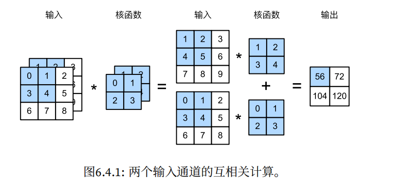
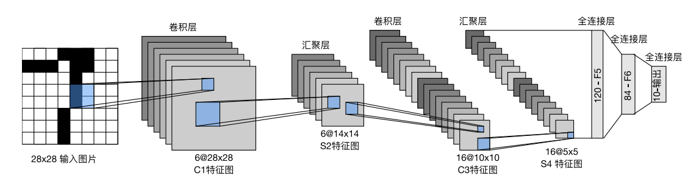

# 1. 卷积操作

## 1.1 基本操作

卷积是通过一个 n * m的卷积核对图像进行操作。比如我们需要对图像进行模糊操作，那么我们需要将图像的细节信息进行消除，最容易想到的就是均值滤波，那么我们可以设计一个卷积核为：
$$
\Large \frac{1}{9}\begin{bmatrix}
1&1&1\\
1&1&1\\
1&1&1\\

\end{bmatrix}
$$
得到的结果：


<center><p>原图</p></center>


<center><p>模糊后</p></center>

很明显细节信息被过滤掉了，当然也可以设计更大的核，这样模糊效果会更明显


```python
import cv2
import torch
import numpy as np


def matrixMul(a, b, i_, j_):
    sum = 0
    for i in range(len(b)):
        for j in range(len(b[0])):
            sum += a[i_ + i][j_ + j] * b[i][j]
    return sum


def conv2d(matrix, kernel):
    size1 = len(matrix) - len(kernel) + 1
    size2 = len(matrix[0]) - len(kernel[0]) + 1
    result = torch.zeros((size1, size2))
    for i in range(size1):
        for j in range(size2):
            result[i][j] = int(matrixMul(matrix, kernel, i, j))
    return result


if __name__ == '__main__':
    path = r"data/img.jpg"
    img = cv2.imread(path, 0)
    kernel = np.ones((9, 9)) / 9 ** 2
    if len(img.shape) == 2:
        height, width = img.shape
    elif len(img.shape) == 3:
        height, width, channel = img.shape
    img = cv2.resize(img, dsize=(int(width / 6), int(height / 6)))
    img2 = conv2d(img, kernel).numpy()
    img2 = np.array(img2, dtype=np.uint8)
    cv2.imshow("img", img)
    cv2.imshow("img2", img2)
    cv2.waitKey()
```


卷积核内部的概率分布，会帮助我们获得接近此概率分布的图像，例如满足高斯分布的卷积核


会更符合相机虚焦的既视感

~~~python
import cv2
import torch
import numpy as np


def matrixMul(a, b, i_, j_):
    sum = 0
    for i in range(len(b)):
        for j in range(len(b[0])):
            sum += a[i_ + i][j_ + j] * b[i][j]
    return sum


def conv2d(matrix, kernel):
    size1 = len(matrix) - len(kernel) + 1
    size2 = len(matrix[0]) - len(kernel[0]) + 1
    result = torch.zeros((size1, size2))
    for i in range(size1):
        for j in range(size2):
            result[i][j] = int(matrixMul(matrix, kernel, i, j))
    return result


if __name__ == '__main__':
    path = r"data/img.jpg"
    img = cv2.imread(path, 0)
    kernel_size = 5  # 或者使用其他奇数的大小
    sigma = 5
    gaussian_kernel = np.fromfunction(
        lambda x, y: (1 / (2 * np.pi * sigma ** 2)) * np.exp(
            -((x - (kernel_size - 1) / 2) ** 2 + (y - (kernel_size - 1) / 2) ** 2) / (2 * sigma ** 2)),
        (kernel_size, kernel_size)
    )
    gaussian_kernel /= np.sum(gaussian_kernel)
    kernel = gaussian_kernel
    if len(img.shape) == 2:
        height, width = img.shape
    elif len(img.shape) == 3:
        height, width, channel = img.shape
    img = cv2.resize(img, dsize=(int(width / 6), int(height / 6)))
    img2 = conv2d(img, kernel).numpy()
    img2 = np.array(img2, dtype=np.uint8)
    cv2.imshow("img", img)
    cv2.imshow("img2", img2)
    cv2.waitKey()
~~~


尺寸关系是：
$$
\Large height = len(matrix) - len(kernel) + 1
$$

$$
\Large width =  len(matrix[0]) - len(kernel[0]) + 1
$$


## 1.2 步幅(stride)与填充(padding)

### 1.2.1 步幅(stride)

输出影响：

1. **步幅为1：** 在这种情况下，滤波器每次只移动一个步长，输出的空间维度与输入相比不发生变化。
2. **步幅大于1：** 如果步幅大于1，滤波器在输入上移动的距离更大，输出的空间维度会减小。这有助于减少计算成本，同时可能损失一些空间信息。

训练影响：

1. **感受野大小：** 步幅的增加会导致每个神经元的感受野减小。感受野是指影响单个神经元输出的输入区域大小。当步幅较大时，每个神经元只能看到输入中的一小部分，这可能减少神经元对全局特征的感知能力。
2. **空间分辨率：** 步幅的选择会影响输出的空间分辨率。较大的步幅会导致输出的空间维度减小，从而可能失去一些细节信息。相反，较小的步幅可能会保留更多的空间信息，但计算成本也会相应增加。
3. **计算成本：** 步幅的选择直接影响计算成本。较大的步幅通常会减少计算量，因为需要处理的输入数据较少。这在一些资源受限的场景下可能是一个考虑因素。
4. **特征多样性：** 步幅的选择也可以影响网络学到的特征的多样性。较大的步幅可能导致网络学到的特征更为抽象，而较小的步幅可能使得网络能够学到更细粒度的特征。

跨度就是让卷积核的步进


尺寸关系是：
$$
\Large height = \lfloor \frac{(len(matrix) - len(kernel) + 1)}{stride}) \rfloor
$$

$$
\Large width =  \lfloor \frac{(len(matrix[0]) - len(kernel[0]) + 1)}{stride} \rfloor
$$


```python
def getIndex(length, stride):
    i = 0
    while True:
        yield i
        i += stride
        if i >= length:
            i = length - 1
            yield i
            return
```


### 1.2.2 填充(padding)

边缘填充（padding）在卷积中的作用主要有两个方面：

1. **防止信息丢失：** 在进行卷积操作时，输入的边缘像素会参与计算的次数较少，因为它们周围的邻域没有完全包含在卷积窗口内。这会导致输出的尺寸缩小，并且模型对输入边缘信息的敏感性降低。通过在输入的周围填充一圈像素，可以确保输入的所有像素都能够参与到卷积计算中，防止边缘信息的丢失。
2. **保持特征图尺寸：** 填充可以用来保持输入和输出的尺寸相同，这在设计深度神经网络时非常有用。如果不使用填充，每次卷积操作都会导致输出尺寸减小，最终可能使得特征图的尺寸过小，失去了输入数据的空间信息。填充可以保持输出特征图的尺寸与输入相同，有助于维持更多的空间信息。

填充方式包括零填充（Zero Padding）和边界填充（Border Padding），零填充是在边缘添加零值，边界填充是通过复制输入的边缘值进行填充


尺寸关系：
$$
\Large height = \lfloor \frac{(len(matrix) - len(kernel) + 1 + padding_H\cdot 2)}{stride}) \rfloor
$$

$$
\Large width =  \lfloor \frac{(len(matrix[0]) - len(kernel[0]) + 1 + padding_W\cdot 2)}{stride} \rfloor
$$


## 1.3 多通道输入输出



多通道输出直接拼接即可

## 1.4  1 * 1卷积

1. **通道维度的降维和升维：** 通过使用1x1卷积核，可以在不改变特征图的空间维度的情况下，对通道维度进行降维或升维。这种操作有时被称为通道的线性组合。在降维时，1x1卷积核相当于执行一种特征压缩，可以减少模型的参数量和计算成本。在升维时，1x1卷积核可以增加通道的非线性表达能力。

   

2. **特征交互和表示学习：** 即使卷积核的尺寸只有1x1，仍然可以通过学习不同的权重来捕捉输入特征之间的复杂关系。这有助于网络学到更抽象和更高级别的特征表示。

3. **非线性映射：** 1x1卷积操作通常结合了非线性激活函数，例如ReLU。这使得网络可以学到非线性的映射，增强了网络的表达能力。

4. **网络的计算效率：** 1x1卷积核可以降低网络的计算负担。在合适的情况下，通过使用1x1卷积层，可以在保持模型性能的同时减少参数数量和计算复杂度。


# 2. Lenet-5

使用FashionMNIST来作为训练集和验证集，输入的是28 * 28的单通道图片



<center><p> LeNet中的数据流</p></center>

```python
class myLenet(nn.Module):
    def __init__(self):
        super(myLenet, self).__init__()
        self.conv1 = nn.Conv2d(in_channels=1, out_channels=6, kernel_size=5, stride=1,
                               padding=2)  # inputSize - 5 + 1 + 2 * 2
        self.pool1 = nn.AvgPool2d(kernel_size=2, stride=2)  # (inputSize - 2 ) / 2 + 1
        self.conv2 = nn.Conv2d(in_channels=6, out_channels=16, kernel_size=5, stride=1)  # inputSize - 5 + 1
        self.pool2 = nn.AvgPool2d(kernel_size=2, stride=2)  # (inputSize - 2 ) / 2 + 1
        self.fc1 = nn.Linear(in_features=16 * 5 * 5, out_features=120)
        self.fc2 = nn.Linear(in_features=120, out_features=84)
        self.fc3 = nn.Linear(in_features=84, out_features=10)
        self.relu = nn.ReLU()
        self.Flatten = nn.Flatten()
        self.Softmax = nn.Softmax()

    def forward(self, x):
        x = self.pool1(self.relu(self.conv1(x)))  # [(28 - 5 + 1 + 2 * 2)=28 - 2 ] / 2 + 1= 14
        x = self.pool2(self.relu(self.conv2(x)))  # [(14 - 5 + 1)=10 - 2] / 2 + 1 = 5
        x = self.Flatten(x)
        x = self.relu(self.fc1(x))
        x = self.relu(self.fc2(x))
        x = self.Softmax(self.fc3(x))
        return x
```


<center><p>Letnet-5的训练结果</p></center>


# 3. 实验

## 3.1 修改stride

这个实验是看在MNIST-Fashion数据集中，魔改Lenet-5，修改stride会带来什么影响

将载入图片都换成100 x 100的分辨率

```python
    trainLoader, testLoader = load_data_fashion_MNIST(256, (100, 100))
```

然后制作三个不同stride的模型

```python
class myLenet0(nn.Module):
    def __init__(self):
        super(myLenet1, self).__init__()
        self.conv1 = nn.Conv2d(in_channels=1, out_channels=6, kernel_size=5, stride=1,
                               padding=2)  # inputSize - 5 + 1 + 2 * 2
        self.pool1 = nn.AvgPool2d(kernel_size=2, stride=2)  # (inputSize - 2 ) / 2 + 1
        self.conv2 = nn.Conv2d(in_channels=6, out_channels=16, kernel_size=5, stride=1)  # inputSize - 5 + 1
        self.pool2 = nn.AvgPool2d(kernel_size=2, stride=2)  # (inputSize - 2 ) / 2 + 1
        self.fc1 = nn.Linear(in_features=92 ** 2, out_features=92 ** 2 * 2)
        self.fc2 = nn.Linear(in_features=92 ** 2 * 2, out_features=84)
        self.fc3 = nn.Linear(in_features=84, out_features=10)
        self.relu = nn.ReLU()
        self.Flatten = nn.Flatten()
        self.Softmax = nn.Softmax()

    def forward(self, x):
        x = self.pool1(self.relu(self.conv1(x)))  # [(28 - 5 + 1 + 2 * 2)=28 - 2 ] / 2 + 1= 14
        x = self.pool2(self.relu(self.conv2(x)))  # [(14 - 5 + 1)=10 - 2] / 2 + 1 = 5
        x = self.Flatten(x)
        x = self.relu(self.fc1(x))
        x = self.relu(self.fc2(x))
        x = self.Softmax(self.fc3(x))
        return x


class myLenet1(nn.Module):
    def __init__(self):
        super(myLenet2, self).__init__()
        self.conv1 = nn.Conv2d(in_channels=1, out_channels=6, kernel_size=5, stride=3,
                               padding=2)  # inputSize - 5 + 1 + 2 * 2
        self.pool1 = nn.AvgPool2d(kernel_size=2, stride=2)  # (inputSize - 2 ) / 2 + 1
        self.conv2 = nn.Conv2d(in_channels=6, out_channels=16, kernel_size=5, stride=2)  # inputSize - 5 + 1
        self.pool2 = nn.AvgPool2d(kernel_size=2, stride=2)  # (inputSize - 2 ) / 2 + 1
        self.fc1 = nn.Linear(in_features=12 ** 2, out_features=180)
        self.fc2 = nn.Linear(in_features=180, out_features=84)
        self.fc3 = nn.Linear(in_features=84, out_features=10)
        self.relu = nn.ReLU()
        self.Flatten = nn.Flatten()
        self.Softmax = nn.Softmax()

    def forward(self, x):
        x = self.pool1(self.relu(self.conv1(x)))  # [(28 - 5 + 1 + 2 * 2)=28 - 2 ] / 2 + 1= 14
        x = self.pool2(self.relu(self.conv2(x)))  # [(14 - 5 + 1)=10 - 2] / 2 + 1 = 5
        x = self.Flatten(x)
        x = self.relu(self.fc1(x))
        x = self.relu(self.fc2(x))
        x = self.Softmax(self.fc3(x))
        return x


class myLenet2(nn.Module):
    def __init__(self):
        super(myLenet3, self).__init__()
        self.conv1 = nn.Conv2d(in_channels=1, out_channels=6, kernel_size=5, stride=4,
                               padding=2)  # inputSize - 5 + 1 + 2 * 2
        self.pool1 = nn.AvgPool2d(kernel_size=2, stride=2)  # (inputSize - 2 ) / 2 + 1
        self.conv2 = nn.Conv2d(in_channels=6, out_channels=16, kernel_size=5, stride=4)  # inputSize - 5 + 1
        self.pool2 = nn.AvgPool2d(kernel_size=2, stride=2)  # (inputSize - 2 ) / 2 + 1
        self.fc1 = nn.Linear(in_features=4 ** 2, out_features=32)
        self.fc2 = nn.Linear(in_features=32, out_features=16)
        self.fc3 = nn.Linear(in_features=16, out_features=10)
        self.relu = nn.ReLU()
        self.Flatten = nn.Flatten()
        self.Softmax = nn.Softmax()

    def forward(self, x):
        x = self.pool1(self.relu(self.conv1(x)))  # [(28 - 5 + 1 + 2 * 2)=28 - 2 ] / 2 + 1= 14
        x = self.pool2(self.relu(self.conv2(x)))  # [(14 - 5 + 1)=10 - 2] / 2 + 1 = 5
        x = self.Flatten(x)
        x = self.relu(self.fc1(x))
        x = self.relu(self.fc2(x))
        x = self.Softmax(self.fc3(x))
        return x

```

batchsize都是256，epoch都是100


<center><p>三个不同的model训练的结果</p></center>

我们可以发现，stride的增大带来最直接的影响就是，==缩短了训练时长的同时，使得特征提取更加抽象和粗糙，未必就能带来收敛速度的提升，但很可能带来精度的降低甚至不收敛==


